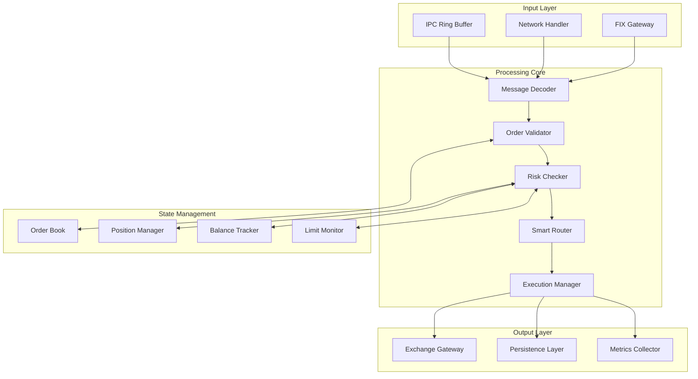

# Core Engine Architecture

Detailed architecture documentation for the C++ high-performance trading engine.

## Overview

The mExOms Core Engine is a ultra-low latency order processing system written in modern C++20. It handles order validation, risk management, position tracking, and routing decisions with sub-100 microsecond latency.

## Design Principles

### 1. Zero-Copy Architecture
- Memory-mapped files for inter-process communication
- Ring buffers for lock-free message passing
- Pre-allocated object pools
- Stack-allocated small objects

### 2. Lock-Free Programming
- Atomic operations for synchronization
- Wait-free algorithms where possible
- Single-producer single-consumer (SPSC) queues
- Hazard pointers for memory reclamation

### 3. Cache-Friendly Design
- Data structure padding to prevent false sharing
- Hot/cold data separation
- Prefetching for predictable access patterns
- NUMA-aware memory allocation

### 4. Deterministic Performance
- No dynamic memory allocation in hot path
- Compile-time polymorphism (templates)
- Branch prediction optimization
- CPU affinity and core isolation

## Architecture Components

### Component Diagram



### Core Components

#### 1. Message Decoder
```cpp
template<typename MessageType>
class MessageDecoder {
    static constexpr size_t CACHE_LINE_SIZE = 64;
    
    struct alignas(CACHE_LINE_SIZE) DecoderStats {
        std::atomic<uint64_t> messages_processed{0};
        std::atomic<uint64_t> decode_errors{0};
        std::atomic<uint64_t> total_latency_ns{0};
    };
    
public:
    [[nodiscard]] std::optional<MessageType> decode(const uint8_t* buffer, size_t size) noexcept {
        auto start = std::chrono::high_resolution_clock::now();
        
        // Fast path for common message types
        if (likely(size >= sizeof(MessageHeader))) {
            const auto* header = reinterpret_cast<const MessageHeader*>(buffer);
            
            switch (header->message_type) {
                case MessageType::NEW_ORDER:
                    return decode_new_order(buffer, size);
                case MessageType::CANCEL_ORDER:
                    return decode_cancel_order(buffer, size);
                case MessageType::MODIFY_ORDER:
                    return decode_modify_order(buffer, size);
                default:
                    stats_.decode_errors.fetch_add(1, std::memory_order_relaxed);
                    return std::nullopt;
            }
        }
        
        auto end = std::chrono::high_resolution_clock::now();
        auto latency = std::chrono::duration_cast<std::chrono::nanoseconds>(end - start).count();
        stats_.total_latency_ns.fetch_add(latency, std::memory_order_relaxed);
        stats_.messages_processed.fetch_add(1, std::memory_order_relaxed);
        
        return std::nullopt;
    }
    
private:
    alignas(CACHE_LINE_SIZE) DecoderStats stats_;
};
```

#### 2. Order Validator
```cpp
class OrderValidator {
    using Clock = std::chrono::steady_clock;
    
public:
    enum class ValidationResult {
        VALID,
        INVALID_SYMBOL,
        INVALID_QUANTITY,
        INVALID_PRICE,
        INSUFFICIENT_BALANCE,
        RATE_LIMIT_EXCEEDED,
        MARKET_CLOSED
    };
    
    [[nodiscard]] ValidationResult validate(const Order& order) const noexcept {
        // Symbol validation
        if (!symbol_validator_.is_valid(order.symbol)) {
            return ValidationResult::INVALID_SYMBOL;
        }
        
        // Quantity validation
        if (order.quantity <= 0 || order.quantity > MAX_ORDER_QUANTITY) {
            return ValidationResult::INVALID_QUANTITY;
        }
        
        // Price validation for limit orders
        if (order.type == OrderType::LIMIT) {
            if (order.price <= 0 || order.price > MAX_ORDER_PRICE) {
                return ValidationResult::INVALID_PRICE;
            }
        }
        
        // Rate limit check
        if (!rate_limiter_.try_acquire(order.user_id)) {
            return ValidationResult::RATE_LIMIT_EXCEEDED;
        }
        
        // Market hours check
        if (!market_calendar_.is_open(order.symbol, Clock::now())) {
            return ValidationResult::MARKET_CLOSED;
        }
        
        return ValidationResult::VALID;
    }
    
private:
    SymbolValidator symbol_validator_;
    RateLimiter rate_limiter_;
    MarketCalendar market_calendar_;
    
    static constexpr double MAX_ORDER_QUANTITY = 1'000'000.0;
    static constexpr double MAX_ORDER_PRICE = 1'000'000.0;
};
```

#### 3. Risk Engine
```cpp
template<typename PositionManager, typename BalanceTracker>
class RiskEngine {
    struct RiskLimits {
        double max_position_size;
        double max_order_value;
        double max_daily_loss;
        double max_leverage;
        double position_concentration;
    };
    
public:
    struct RiskCheckResult {
        bool passed;
        double current_exposure;
        double available_balance;
        double current_leverage;
        std::string rejection_reason;
    };
    
    [[nodiscard]] RiskCheckResult check_order(const Order& order) const noexcept {
        // Get current position and balance
        const auto position = position_manager_.get_position(order.symbol);
        const auto balance = balance_tracker_.get_available_balance(order.account_id);
        
        // Calculate new position after order
        const double new_position = calculate_new_position(position, order);
        const double order_value = calculate_order_value(order);
        
        // Check position limits
        if (std::abs(new_position) > limits_.max_position_size) {
            return {false, new_position, balance, 0.0, "Position limit exceeded"};
        }
        
        // Check order value limits
        if (order_value > limits_.max_order_value) {
            return {false, new_position, balance, 0.0, "Order value too large"};
        }
        
        // Check available balance
        if (order_value > balance) {
            return {false, new_position, balance, 0.0, "Insufficient balance"};
        }
        
        // Calculate leverage
        const double total_exposure = calculate_total_exposure();
        const double leverage = total_exposure / balance;
        
        if (leverage > limits_.max_leverage) {
            return {false, new_position, balance, leverage, "Leverage limit exceeded"};
        }
        
        // Check daily loss limit
        const double daily_pnl = position_manager_.get_daily_pnl();
        if (daily_pnl < -limits_.max_daily_loss) {
            return {false, new_position, balance, leverage, "Daily loss limit reached"};
        }
        
        return {true, new_position, balance, leverage, ""};
    }
    
private:
    [[nodiscard]] double calculate_new_position(const Position& current, const Order& order) const noexcept {
        const double quantity = (order.side == Side::BUY) ? order.quantity : -order.quantity;
        return current.quantity + quantity;
    }
    
    [[nodiscard]] double calculate_order_value(const Order& order) const noexcept {
        if (order.type == OrderType::MARKET) {
            const auto market_price = price_feed_.get_last_price(order.symbol);
            return order.quantity * market_price;
        }
        return order.quantity * order.price;
    }
    
    [[nodiscard]] double calculate_total_exposure() const noexcept {
        double total = 0.0;
        position_manager_.for_each_position([&total](const Position& pos) {
            total += std::abs(pos.quantity * pos.mark_price);
        });
        return total;
    }
    
    const PositionManager& position_manager_;
    const BalanceTracker& balance_tracker_;
    const PriceFeed& price_feed_;
    const RiskLimits limits_;
};
```

#### 4. Smart Order Router
```cpp
class SmartOrderRouter {
    struct ExchangeMetrics {
        std::atomic<uint64_t> total_orders{0};
        std::atomic<uint64_t> successful_orders{0};
        std::atomic<uint64_t> total_latency_us{0};
        std::atomic<double> fill_rate{0.0};
        std::atomic<double> average_slippage{0.0};
    };
    
    struct RouteDecision {
        std::string exchange;
        double expected_price;
        double expected_fee;
        uint64_t expected_latency_us;
        double confidence_score;
    };
    
public:
    [[nodiscard]] RouteDecision route_order(const Order& order) const noexcept {
        std::vector<RouteDecision> candidates;
        candidates.reserve(exchanges_.size());
        
        // Evaluate each exchange
        for (const auto& [exchange_name, exchange_info] : exchanges_) {
            if (!exchange_info.is_active || !exchange_info.supports_symbol(order.symbol)) {
                continue;
            }
            
            const auto orderbook = exchange_info.get_orderbook(order.symbol);
            const auto expected_price = calculate_expected_price(order, orderbook);
            const auto expected_fee = calculate_fee(order, exchange_info.fee_schedule);
            const auto expected_latency = exchange_info.metrics.total_latency_us.load() / 
                                         std::max(1UL, exchange_info.metrics.total_orders.load());
            
            const double confidence = calculate_confidence_score(
                exchange_info.metrics,
                orderbook.depth,
                orderbook.spread
            );
            
            candidates.push_back({
                exchange_name,
                expected_price,
                expected_fee,
                expected_latency,
                confidence
            });
        }
        
        // Select best route based on execution quality
        return select_best_route(candidates, order);
    }
    
private:
    [[nodiscard]] double calculate_expected_price(const Order& order, const OrderBook& book) const noexcept {
        double total_quantity = 0.0;
        double total_value = 0.0;
        
        const auto& levels = (order.side == Side::BUY) ? book.asks : book.bids;
        
        for (const auto& level : levels) {
            const double level_quantity = std::min(order.quantity - total_quantity, level.quantity);
            total_value += level_quantity * level.price;
            total_quantity += level_quantity;
            
            if (total_quantity >= order.quantity) {
                break;
            }
        }
        
        return (total_quantity > 0) ? total_value / total_quantity : 0.0;
    }
    
    [[nodiscard]] RouteDecision select_best_route(
        const std::vector<RouteDecision>& candidates,
        const Order& order) const noexcept {
        
        if (candidates.empty()) {
            return {"NONE", 0.0, 0.0, 0, 0.0};
        }
        
        // Score each route based on expected execution quality
        double best_score = -std::numeric_limits<double>::infinity();
        RouteDecision best_route = candidates[0];
        
        for (const auto& route : candidates) {
            double score = 0.0;
            
            // Price improvement (most important)
            const double price_factor = (order.side == Side::BUY) 
                ? -route.expected_price  // Lower is better for buys
                : route.expected_price;  // Higher is better for sells
            score += price_factor * 1000.0;  // High weight for price
            
            // Fee impact
            score -= route.expected_fee * 100.0;
            
            // Latency penalty (important for market orders)
            if (order.type == OrderType::MARKET) {
                score -= route.expected_latency_us * 0.001;
            }
            
            // Confidence bonus
            score += route.confidence_score * 10.0;
            
            if (score > best_score) {
                best_score = score;
                best_route = route;
            }
        }
        
        return best_route;
    }
    
    std::unordered_map<std::string, ExchangeInfo> exchanges_;
};
```

## Memory Architecture

### Memory Layout

```cpp
// Cache-aligned memory allocation
template<typename T>
class CacheAligned {
    static constexpr size_t CACHE_LINE_SIZE = 64;
    
public:
    T* allocate(size_t count) {
        size_t size = count * sizeof(T);
        size_t aligned_size = (size + CACHE_LINE_SIZE - 1) & ~(CACHE_LINE_SIZE - 1);
        
        void* ptr = std::aligned_alloc(CACHE_LINE_SIZE, aligned_size);
        if (!ptr) {
            throw std::bad_alloc();
        }
        
        return static_cast<T*>(ptr);
    }
    
    void deallocate(T* ptr, size_t) {
        std::free(ptr);
    }
};

// Memory pool for order objects
template<typename T, size_t PoolSize = 1024>
class ObjectPool {
    struct Node {
        alignas(T) char storage[sizeof(T)];
        Node* next;
    };
    
public:
    ObjectPool() {
        // Pre-allocate all nodes
        nodes_ = std::make_unique<Node[]>(PoolSize);
        
        // Initialize free list
        free_list_ = &nodes_[0];
        for (size_t i = 0; i < PoolSize - 1; ++i) {
            nodes_[i].next = &nodes_[i + 1];
        }
        nodes_[PoolSize - 1].next = nullptr;
    }
    
    template<typename... Args>
    [[nodiscard]] T* acquire(Args&&... args) {
        Node* node = free_list_.load(std::memory_order_acquire);
        
        while (node) {
            Node* next = node->next;
            if (free_list_.compare_exchange_weak(node, next,
                                                std::memory_order_release,
                                                std::memory_order_acquire)) {
                return new (node->storage) T(std::forward<Args>(args)...);
            }
        }
        
        // Pool exhausted
        return nullptr;
    }
    
    void release(T* obj) {
        obj->~T();
        
        Node* node = reinterpret_cast<Node*>(obj);
        Node* head = free_list_.load(std::memory_order_acquire);
        
        do {
            node->next = head;
        } while (!free_list_.compare_exchange_weak(head, node,
                                                  std::memory_order_release,
                                                  std::memory_order_acquire));
    }
    
private:
    std::unique_ptr<Node[]> nodes_;
    std::atomic<Node*> free_list_;
};
```

### Ring Buffer Implementation

```cpp
template<typename T, size_t Size>
class SPSCRingBuffer {
    static_assert((Size & (Size - 1)) == 0, "Size must be power of 2");
    
public:
    SPSCRingBuffer() : head_(0), tail_(0) {
        // Ensure cache line separation
        static_assert(offsetof(SPSCRingBuffer, head_) + sizeof(head_) <= 64);
        static_assert(offsetof(SPSCRingBuffer, tail_) >= 64);
    }
    
    [[nodiscard]] bool try_push(const T& item) noexcept {
        const size_t current_tail = tail_.load(std::memory_order_relaxed);
        const size_t next_tail = (current_tail + 1) & (Size - 1);
        
        if (next_tail == head_.load(std::memory_order_acquire)) {
            return false; // Buffer full
        }
        
        buffer_[current_tail] = item;
        tail_.store(next_tail, std::memory_order_release);
        return true;
    }
    
    [[nodiscard]] std::optional<T> try_pop() noexcept {
        const size_t current_head = head_.load(std::memory_order_relaxed);
        
        if (current_head == tail_.load(std::memory_order_acquire)) {
            return std::nullopt; // Buffer empty
        }
        
        T item = std::move(buffer_[current_head]);
        head_.store((current_head + 1) & (Size - 1), std::memory_order_release);
        return item;
    }
    
private:
    alignas(64) std::atomic<size_t> head_;
    alignas(64) std::atomic<size_t> tail_;
    alignas(64) std::array<T, Size> buffer_;
};
```

## Performance Optimizations

### 1. Branch Prediction

```cpp
// Likely/unlikely macros for branch prediction
#define likely(x)   __builtin_expect(!!(x), 1)
#define unlikely(x) __builtin_expect(!!(x), 0)

// Hot/cold function attributes
#define HOT_FUNCTION  __attribute__((hot))
#define COLD_FUNCTION __attribute__((cold))

// Example usage
HOT_FUNCTION
void process_order(const Order& order) {
    if (likely(order.type == OrderType::LIMIT)) {
        // Fast path for limit orders (most common)
        process_limit_order(order);
    } else if (unlikely(order.type == OrderType::STOP_LOSS)) {
        // Slow path for stop orders (less common)
        process_stop_order(order);
    }
}
```

### 2. CPU Affinity

```cpp
class ThreadManager {
public:
    static void pin_to_cpu(std::thread& thread, int cpu_id) {
        cpu_set_t cpuset;
        CPU_ZERO(&cpuset);
        CPU_SET(cpu_id, &cpuset);
        
        int rc = pthread_setaffinity_np(
            thread.native_handle(),
            sizeof(cpu_set_t),
            &cpuset
        );
        
        if (rc != 0) {
            throw std::runtime_error("Failed to set CPU affinity");
        }
    }
    
    static void configure_realtime_priority(std::thread& thread, int priority) {
        struct sched_param params;
        params.sched_priority = priority;
        
        int rc = pthread_setschedparam(
            thread.native_handle(),
            SCHED_FIFO,
            &params
        );
        
        if (rc != 0) {
            throw std::runtime_error("Failed to set realtime priority");
        }
    }
};

// Usage
void start_engine() {
    // Order processing thread - highest priority
    std::thread order_thread(order_processing_loop);
    ThreadManager::pin_to_cpu(order_thread, 0);
    ThreadManager::configure_realtime_priority(order_thread, 99);
    
    // Risk management thread
    std::thread risk_thread(risk_management_loop);
    ThreadManager::pin_to_cpu(risk_thread, 1);
    ThreadManager::configure_realtime_priority(risk_thread, 95);
    
    // Market data thread
    std::thread market_thread(market_data_loop);
    ThreadManager::pin_to_cpu(market_thread, 2);
    ThreadManager::configure_realtime_priority(market_thread, 90);
}
```

### 3. Memory Prefetching

```cpp
template<typename T>
class PrefetchArray {
public:
    void process_batch(const T* array, size_t count) {
        constexpr size_t PREFETCH_DISTANCE = 8;
        
        size_t i = 0;
        
        // Process with prefetching
        for (; i + PREFETCH_DISTANCE < count; ++i) {
            __builtin_prefetch(&array[i + PREFETCH_DISTANCE], 0, 3);
            process_item(array[i]);
        }
        
        // Process remaining items
        for (; i < count; ++i) {
            process_item(array[i]);
        }
    }
    
private:
    void process_item(const T& item);
};
```

## Monitoring and Metrics

### Performance Counters

```cpp
class PerformanceMonitor {
    struct Metrics {
        std::atomic<uint64_t> orders_processed{0};
        std::atomic<uint64_t> orders_rejected{0};
        std::atomic<uint64_t> total_latency_ns{0};
        std::atomic<uint64_t> p50_latency_ns{0};
        std::atomic<uint64_t> p95_latency_ns{0};
        std::atomic<uint64_t> p99_latency_ns{0};
        std::atomic<uint64_t> max_latency_ns{0};
    };
    
public:
    class ScopedTimer {
    public:
        explicit ScopedTimer(PerformanceMonitor& monitor)
            : monitor_(monitor)
            , start_(std::chrono::high_resolution_clock::now()) {}
        
        ~ScopedTimer() {
            auto end = std::chrono::high_resolution_clock::now();
            auto latency = std::chrono::duration_cast<std::chrono::nanoseconds>(end - start_).count();
            monitor_.record_latency(latency);
        }
        
    private:
        PerformanceMonitor& monitor_;
        std::chrono::time_point<std::chrono::high_resolution_clock> start_;
    };
    
    void record_latency(uint64_t latency_ns) {
        metrics_.total_latency_ns.fetch_add(latency_ns, std::memory_order_relaxed);
        metrics_.orders_processed.fetch_add(1, std::memory_order_relaxed);
        
        // Update percentiles (simplified - real implementation would use HDR histogram)
        update_percentiles(latency_ns);
        
        // Update max latency
        uint64_t current_max = metrics_.max_latency_ns.load(std::memory_order_relaxed);
        while (latency_ns > current_max) {
            if (metrics_.max_latency_ns.compare_exchange_weak(
                    current_max, latency_ns,
                    std::memory_order_relaxed,
                    std::memory_order_relaxed)) {
                break;
            }
        }
    }
    
    void export_metrics() const {
        const auto count = metrics_.orders_processed.load(std::memory_order_relaxed);
        const auto total_latency = metrics_.total_latency_ns.load(std::memory_order_relaxed);
        const auto avg_latency = count > 0 ? total_latency / count : 0;
        
        // Export to monitoring system
        prometheus::Gauge* latency_gauge = prometheus::BuildGauge()
            .Name("order_processing_latency_nanoseconds")
            .Help("Order processing latency")
            .Register(*registry_)
            .Add({});
            
        latency_gauge->Set(avg_latency);
    }
    
private:
    alignas(64) Metrics metrics_;
    prometheus::Registry* registry_;
};
```

## Testing Strategy

### Microbenchmarks

```cpp
// Google Benchmark example
static void BM_OrderValidation(benchmark::State& state) {
    OrderValidator validator;
    Order order{
        .symbol = "BTCUSDT",
        .side = Side::BUY,
        .type = OrderType::LIMIT,
        .quantity = 1.0,
        .price = 50000.0,
        .user_id = 12345
    };
    
    for (auto _ : state) {
        auto result = validator.validate(order);
        benchmark::DoNotOptimize(result);
    }
    
    state.SetItemsProcessed(state.iterations());
}

BENCHMARK(BM_OrderValidation);

static void BM_RiskCheck(benchmark::State& state) {
    RiskEngine risk_engine;
    Order order{
        .symbol = "BTCUSDT",
        .side = Side::BUY,
        .quantity = 1.0,
        .account_id = 12345
    };
    
    for (auto _ : state) {
        auto result = risk_engine.check_order(order);
        benchmark::DoNotOptimize(result);
    }
    
    state.SetItemsProcessed(state.iterations());
}

BENCHMARK(BM_RiskCheck);
```

### Load Testing

```cpp
class LoadGenerator {
public:
    struct LoadTestResult {
        uint64_t total_orders;
        uint64_t successful_orders;
        uint64_t failed_orders;
        double orders_per_second;
        double p50_latency_us;
        double p95_latency_us;
        double p99_latency_us;
        double max_latency_us;
    };
    
    LoadTestResult run_test(uint64_t target_ops, std::chrono::seconds duration) {
        std::vector<uint64_t> latencies;
        latencies.reserve(target_ops * duration.count());
        
        std::atomic<uint64_t> successful_orders{0};
        std::atomic<uint64_t> failed_orders{0};
        
        auto start_time = std::chrono::steady_clock::now();
        auto end_time = start_time + duration;
        
        // Generate orders at target rate
        while (std::chrono::steady_clock::now() < end_time) {
            auto order_start = std::chrono::high_resolution_clock::now();
            
            Order order = generate_random_order();
            bool success = engine_->process_order(order);
            
            auto order_end = std::chrono::high_resolution_clock::now();
            auto latency = std::chrono::duration_cast<std::chrono::microseconds>
                          (order_end - order_start).count();
            
            latencies.push_back(latency);
            
            if (success) {
                successful_orders.fetch_add(1, std::memory_order_relaxed);
            } else {
                failed_orders.fetch_add(1, std::memory_order_relaxed);
            }
            
            // Rate limiting
            std::this_thread::sleep_until(order_start + 
                std::chrono::microseconds(1'000'000 / target_ops));
        }
        
        // Calculate percentiles
        std::sort(latencies.begin(), latencies.end());
        
        LoadTestResult result{
            .total_orders = successful_orders + failed_orders,
            .successful_orders = successful_orders,
            .failed_orders = failed_orders,
            .orders_per_second = static_cast<double>(successful_orders) / duration.count(),
            .p50_latency_us = calculate_percentile(latencies, 0.50),
            .p95_latency_us = calculate_percentile(latencies, 0.95),
            .p99_latency_us = calculate_percentile(latencies, 0.99),
            .max_latency_us = latencies.empty() ? 0.0 : static_cast<double>(latencies.back())
        };
        
        return result;
    }
    
private:
    Engine* engine_;
};
```

## Production Deployment

### System Requirements

- **CPU**: Intel Xeon or AMD EPYC with AVX2 support
- **Cores**: Minimum 8 physical cores, recommended 16+
- **RAM**: 32GB minimum, 64GB recommended
- **Network**: 10Gbps NIC with kernel bypass (DPDK/AF_XDP)
- **Storage**: NVMe SSD for persistence layer
- **OS**: Linux with RT_PREEMPT kernel patch

### Kernel Tuning

```bash
#!/bin/bash
# Kernel parameters for low latency

# Disable CPU frequency scaling
echo performance | tee /sys/devices/system/cpu/cpu*/cpufreq/scaling_governor

# Disable CPU idle states
for i in /sys/devices/system/cpu/cpu*/cpuidle/state*/disable; do
    echo 1 > $i
done

# Disable interrupt coalescing
ethtool -C eth0 rx-usecs 0 tx-usecs 0

# Set interrupt affinity
echo 2 > /proc/irq/24/smp_affinity_list  # Network interrupts to CPU 2

# Disable transparent huge pages
echo never > /sys/kernel/mm/transparent_hugepage/enabled

# Set vm.swappiness to 0
sysctl -w vm.swappiness=0

# Increase network buffer sizes
sysctl -w net.core.rmem_max=134217728
sysctl -w net.core.wmem_max=134217728
sysctl -w net.ipv4.tcp_rmem="4096 87380 134217728"
sysctl -w net.ipv4.tcp_wmem="4096 65536 134217728"
```

### Monitoring Integration

```cpp
class PrometheusExporter {
public:
    void export_engine_metrics(const Engine& engine) {
        // Order metrics
        orders_processed_->Increment(engine.get_orders_processed());
        orders_rejected_->Increment(engine.get_orders_rejected());
        
        // Latency metrics
        order_latency_->Observe(engine.get_average_latency_us());
        
        // Risk metrics
        risk_checks_passed_->Set(engine.get_risk_checks_passed());
        risk_checks_failed_->Set(engine.get_risk_checks_failed());
        
        // Position metrics
        for (const auto& [symbol, position] : engine.get_positions()) {
            position_size_->WithLabelValues({symbol})
                          ->Set(position.quantity);
            position_pnl_->WithLabelValues({symbol})
                         ->Set(position.unrealized_pnl);
        }
    }
    
private:
    prometheus::Counter* orders_processed_;
    prometheus::Counter* orders_rejected_;
    prometheus::Histogram* order_latency_;
    prometheus::Gauge* risk_checks_passed_;
    prometheus::Gauge* risk_checks_failed_;
    prometheus::Gauge* position_size_;
    prometheus::Gauge* position_pnl_;
};
```

---

*This document provides detailed architecture of the C++ core engine. For integration details, see the [System Overview](./system-overview.md).*