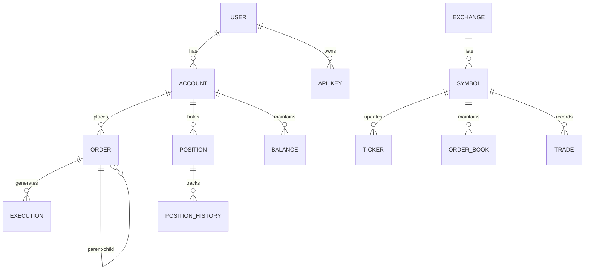

# Data Model Architecture

Documentation of entity relationships, schemas, and data structures used in mExOms.

## Overview

The data model is designed to support high-performance trading operations while maintaining data integrity and enabling complex analytics.

## Core Entities

### 1. User & Account
- User profiles and authentication
- Multiple accounts per user
- Account types (spot, margin, futures)
- Permission management
- API key associations

### 2. Order & Execution
- Order lifecycle tracking
- Execution records
- Order history
- Order relationships (parent/child)
- Conditional order chains

### 3. Position & Balance
- Real-time position tracking
- Multi-exchange aggregation
- Balance snapshots
- P&L calculation
- Margin requirements

### 4. Market Data
- Ticker information
- Order book snapshots
- Trade history
- Candlestick data
- Market statistics

## Entity Relationship Diagram



## Core Entities

### User Entity

```sql
CREATE TABLE users (
    id UUID PRIMARY KEY DEFAULT gen_random_uuid(),
    email VARCHAR(255) UNIQUE NOT NULL,
    username VARCHAR(100) UNIQUE NOT NULL,
    password_hash VARCHAR(255) NOT NULL,
    
    -- Profile
    full_name VARCHAR(255),
    phone VARCHAR(50),
    country VARCHAR(2),
    
    -- Security
    mfa_enabled BOOLEAN DEFAULT false,
    mfa_secret VARCHAR(255),
    email_verified BOOLEAN DEFAULT false,
    
    -- Status
    status VARCHAR(20) DEFAULT 'active', -- active, suspended, deleted
    role VARCHAR(50) DEFAULT 'trader',   -- admin, trader, viewer
    
    -- Timestamps
    created_at TIMESTAMPTZ DEFAULT CURRENT_TIMESTAMP,
    updated_at TIMESTAMPTZ DEFAULT CURRENT_TIMESTAMP,
    last_login_at TIMESTAMPTZ,
    
    -- Indexes
    INDEX idx_users_email (email),
    INDEX idx_users_status (status)
);
```

### Account Entity

```sql
CREATE TABLE accounts (
    id UUID PRIMARY KEY DEFAULT gen_random_uuid(),
    user_id UUID NOT NULL REFERENCES users(id),
    
    -- Account info
    account_name VARCHAR(100) NOT NULL,
    account_type VARCHAR(20) NOT NULL, -- spot, margin, futures
    base_currency VARCHAR(10) DEFAULT 'USD',
    
    -- Trading permissions
    can_trade BOOLEAN DEFAULT true,
    can_withdraw BOOLEAN DEFAULT true,
    
    -- Risk limits
    max_leverage DECIMAL(5,2) DEFAULT 1.00,
    daily_loss_limit DECIMAL(20,8),
    position_limit INTEGER DEFAULT 100,
    
    -- Metadata
    tags JSONB DEFAULT '[]',
    settings JSONB DEFAULT '{}',
    
    created_at TIMESTAMPTZ DEFAULT CURRENT_TIMESTAMP,
    updated_at TIMESTAMPTZ DEFAULT CURRENT_TIMESTAMP,
    
    INDEX idx_accounts_user_id (user_id),
    INDEX idx_accounts_type (account_type)
);
```

### Order Entity

```sql
CREATE TABLE orders (
    id UUID PRIMARY KEY DEFAULT gen_random_uuid(),
    account_id UUID NOT NULL REFERENCES accounts(id),
    
    -- Order identification
    client_order_id VARCHAR(100) UNIQUE,
    exchange_order_id VARCHAR(100),
    parent_order_id UUID REFERENCES orders(id),
    
    -- Order details
    exchange VARCHAR(20) NOT NULL,
    symbol VARCHAR(20) NOT NULL,
    side VARCHAR(4) NOT NULL, -- BUY, SELL
    type VARCHAR(20) NOT NULL, -- MARKET, LIMIT, STOP, etc.
    time_in_force VARCHAR(10) DEFAULT 'GTC', -- GTC, IOC, FOK
    
    -- Quantities and prices
    quantity DECIMAL(20,8) NOT NULL,
    price DECIMAL(20,8),
    stop_price DECIMAL(20,8),
    
    -- Execution info
    status VARCHAR(20) NOT NULL, -- NEW, FILLED, PARTIALLY_FILLED, CANCELLED
    filled_quantity DECIMAL(20,8) DEFAULT 0,
    average_price DECIMAL(20,8),
    commission DECIMAL(20,8) DEFAULT 0,
    commission_asset VARCHAR(10),
    
    -- Timestamps
    created_at TIMESTAMPTZ DEFAULT CURRENT_TIMESTAMP,
    updated_at TIMESTAMPTZ DEFAULT CURRENT_TIMESTAMP,
    submitted_at TIMESTAMPTZ,
    filled_at TIMESTAMPTZ,
    cancelled_at TIMESTAMPTZ,
    
    -- Metadata
    strategy_id VARCHAR(100),
    tags JSONB DEFAULT '[]',
    metadata JSONB DEFAULT '{}',
    
    -- Indexes
    INDEX idx_orders_account_id (account_id),
    INDEX idx_orders_status (status),
    INDEX idx_orders_symbol (symbol),
    INDEX idx_orders_created_at (created_at DESC),
    INDEX idx_orders_strategy_id (strategy_id)
);
```

### Execution Entity

```sql
CREATE TABLE executions (
    id UUID PRIMARY KEY DEFAULT gen_random_uuid(),
    order_id UUID NOT NULL REFERENCES orders(id),
    
    -- Execution details
    execution_id VARCHAR(100) UNIQUE NOT NULL,
    exchange VARCHAR(20) NOT NULL,
    symbol VARCHAR(20) NOT NULL,
    side VARCHAR(4) NOT NULL,
    
    -- Trade info
    price DECIMAL(20,8) NOT NULL,
    quantity DECIMAL(20,8) NOT NULL,
    commission DECIMAL(20,8) DEFAULT 0,
    commission_asset VARCHAR(10),
    
    -- Liquidity
    liquidity_type VARCHAR(10), -- MAKER, TAKER
    
    -- Timestamps
    executed_at TIMESTAMPTZ NOT NULL,
    created_at TIMESTAMPTZ DEFAULT CURRENT_TIMESTAMP,
    
    -- Indexes
    INDEX idx_executions_order_id (order_id),
    INDEX idx_executions_executed_at (executed_at DESC)
);
```

### Position Entity

```sql
CREATE TABLE positions (
    id UUID PRIMARY KEY DEFAULT gen_random_uuid(),
    account_id UUID NOT NULL REFERENCES accounts(id),
    
    -- Position identification
    exchange VARCHAR(20) NOT NULL,
    symbol VARCHAR(20) NOT NULL,
    position_side VARCHAR(10) NOT NULL, -- LONG, SHORT
    
    -- Quantities
    quantity DECIMAL(20,8) NOT NULL,
    average_price DECIMAL(20,8) NOT NULL,
    mark_price DECIMAL(20,8),
    liquidation_price DECIMAL(20,8),
    
    -- P&L
    unrealized_pnl DECIMAL(20,8) DEFAULT 0,
    realized_pnl DECIMAL(20,8) DEFAULT 0,
    
    -- Margin (for futures)
    initial_margin DECIMAL(20,8),
    maintenance_margin DECIMAL(20,8),
    margin_ratio DECIMAL(5,4),
    
    -- Status
    status VARCHAR(20) DEFAULT 'OPEN', -- OPEN, CLOSED
    
    -- Timestamps
    opened_at TIMESTAMPTZ DEFAULT CURRENT_TIMESTAMP,
    updated_at TIMESTAMPTZ DEFAULT CURRENT_TIMESTAMP,
    closed_at TIMESTAMPTZ,
    
    -- Unique constraint for active positions
    UNIQUE(account_id, exchange, symbol, position_side) WHERE status = 'OPEN',
    
    -- Indexes
    INDEX idx_positions_account_id (account_id),
    INDEX idx_positions_status (status),
    INDEX idx_positions_symbol (symbol)
);
```

### Balance Entity

```sql
CREATE TABLE balances (
    id UUID PRIMARY KEY DEFAULT gen_random_uuid(),
    account_id UUID NOT NULL REFERENCES accounts(id),
    
    -- Asset info
    exchange VARCHAR(20) NOT NULL,
    asset VARCHAR(10) NOT NULL,
    
    -- Balances
    free_balance DECIMAL(20,8) NOT NULL DEFAULT 0,
    locked_balance DECIMAL(20,8) NOT NULL DEFAULT 0,
    total_balance DECIMAL(20,8) GENERATED ALWAYS AS (free_balance + locked_balance) STORED,
    
    -- Timestamps
    updated_at TIMESTAMPTZ DEFAULT CURRENT_TIMESTAMP,
    
    -- Unique constraint
    UNIQUE(account_id, exchange, asset),
    
    -- Indexes
    INDEX idx_balances_account_id (account_id),
    INDEX idx_balances_asset (asset)
);
```

### Market Data Entities

#### Ticker Entity

```sql
CREATE TABLE tickers (
    id BIGSERIAL PRIMARY KEY,
    exchange VARCHAR(20) NOT NULL,
    symbol VARCHAR(20) NOT NULL,
    
    -- Price data
    bid_price DECIMAL(20,8),
    bid_quantity DECIMAL(20,8),
    ask_price DECIMAL(20,8),
    ask_quantity DECIMAL(20,8),
    last_price DECIMAL(20,8),
    
    -- Volume data
    volume_24h DECIMAL(20,8),
    quote_volume_24h DECIMAL(20,8),
    
    -- Statistics
    open_price DECIMAL(20,8),
    high_price DECIMAL(20,8),
    low_price DECIMAL(20,8),
    price_change_percent DECIMAL(8,4),
    
    -- Timestamp
    timestamp TIMESTAMPTZ NOT NULL,
    created_at TIMESTAMPTZ DEFAULT CURRENT_TIMESTAMP,
    
    -- Indexes
    INDEX idx_tickers_symbol (symbol, timestamp DESC),
    INDEX idx_tickers_timestamp (timestamp DESC)
) PARTITION BY RANGE (timestamp);

-- Create monthly partitions
CREATE TABLE tickers_2024_01 PARTITION OF tickers
    FOR VALUES FROM ('2024-01-01') TO ('2024-02-01');
```

#### Order Book Snapshot

```sql
CREATE TABLE order_book_snapshots (
    id BIGSERIAL PRIMARY KEY,
    exchange VARCHAR(20) NOT NULL,
    symbol VARCHAR(20) NOT NULL,
    
    -- Order book data (JSONB for flexibility)
    bids JSONB NOT NULL, -- [{"price": "50000.00", "quantity": "1.5"}]
    asks JSONB NOT NULL, -- [{"price": "50001.00", "quantity": "2.0"}]
    
    -- Metadata
    sequence_number BIGINT,
    timestamp TIMESTAMPTZ NOT NULL,
    created_at TIMESTAMPTZ DEFAULT CURRENT_TIMESTAMP,
    
    -- Indexes
    INDEX idx_orderbook_symbol (symbol, timestamp DESC),
    INDEX idx_orderbook_timestamp (timestamp DESC)
) PARTITION BY RANGE (timestamp);
```

#### Trade History

```sql
CREATE TABLE trades (
    id BIGSERIAL PRIMARY KEY,
    exchange VARCHAR(20) NOT NULL,
    symbol VARCHAR(20) NOT NULL,
    
    -- Trade data
    trade_id VARCHAR(100) NOT NULL,
    price DECIMAL(20,8) NOT NULL,
    quantity DECIMAL(20,8) NOT NULL,
    side VARCHAR(4) NOT NULL, -- BUY, SELL
    
    -- Timestamps
    traded_at TIMESTAMPTZ NOT NULL,
    created_at TIMESTAMPTZ DEFAULT CURRENT_TIMESTAMP,
    
    -- Unique constraint
    UNIQUE(exchange, trade_id),
    
    -- Indexes
    INDEX idx_trades_symbol (symbol, traded_at DESC),
    INDEX idx_trades_traded_at (traded_at DESC)
) PARTITION BY RANGE (traded_at);
```

## Data Access Patterns

### Common Queries

```sql
-- Get user's active orders
SELECT o.* FROM orders o
JOIN accounts a ON o.account_id = a.id
WHERE a.user_id = $1 
  AND o.status IN ('NEW', 'PARTIALLY_FILLED')
ORDER BY o.created_at DESC;

-- Calculate account P&L
SELECT 
    SUM(realized_pnl) as total_realized,
    SUM(unrealized_pnl) as total_unrealized,
    SUM(realized_pnl + unrealized_pnl) as total_pnl
FROM positions
WHERE account_id = $1 AND status = 'OPEN';

-- Get order book depth
SELECT 
    timestamp,
    (bids->0->>'price')::DECIMAL as best_bid,
    (asks->0->>'price')::DECIMAL as best_ask,
    (asks->0->>'price')::DECIMAL - (bids->0->>'price')::DECIMAL as spread
FROM order_book_snapshots
WHERE symbol = $1 AND exchange = $2
ORDER BY timestamp DESC
LIMIT 1;
```

### Performance Optimizations

1. **Partitioning Strategy**
   - Time-series data (tickers, trades, order books) partitioned by month
   - Automatic partition management with pg_partman
   - Old partitions archived to cold storage

2. **Indexing Strategy**
   - Composite indexes for common query patterns
   - Partial indexes for filtered queries
   - BRIN indexes for time-series data

3. **Materialized Views**
   ```sql
   CREATE MATERIALIZED VIEW account_summary AS
   SELECT 
       a.id as account_id,
       COUNT(DISTINCT p.symbol) as position_count,
       SUM(p.unrealized_pnl) as total_unrealized_pnl,
       SUM(b.total_balance) as total_balance_usd
   FROM accounts a
   LEFT JOIN positions p ON a.id = p.account_id AND p.status = 'OPEN'
   LEFT JOIN balances b ON a.id = b.account_id
   GROUP BY a.id;
   
   CREATE INDEX idx_account_summary_id ON account_summary(account_id);
   ```

## Data Integrity

### Constraints

1. **Foreign Key Constraints**
   - All references enforced with ON DELETE CASCADE where appropriate
   - Orphaned records prevented

2. **Check Constraints**
   ```sql
   ALTER TABLE orders ADD CONSTRAINT check_quantity_positive 
       CHECK (quantity > 0);
   ALTER TABLE orders ADD CONSTRAINT check_price_positive 
       CHECK (price > 0 OR type != 'LIMIT');
   ALTER TABLE positions ADD CONSTRAINT check_valid_side 
       CHECK (position_side IN ('LONG', 'SHORT'));
   ```

3. **Triggers**
   ```sql
   CREATE TRIGGER update_account_timestamp
   BEFORE UPDATE ON accounts
   FOR EACH ROW
   EXECUTE FUNCTION update_updated_at_column();
   ```

### Audit Trail

```sql
CREATE TABLE audit_log (
    id BIGSERIAL PRIMARY KEY,
    table_name VARCHAR(50) NOT NULL,
    operation VARCHAR(10) NOT NULL, -- INSERT, UPDATE, DELETE
    user_id UUID,
    record_id UUID NOT NULL,
    old_values JSONB,
    new_values JSONB,
    changed_at TIMESTAMPTZ DEFAULT CURRENT_TIMESTAMP,
    
    INDEX idx_audit_table (table_name, changed_at DESC),
    INDEX idx_audit_user (user_id, changed_at DESC)
) PARTITION BY RANGE (changed_at);
```

---

*For database implementation details, see [Database Architecture](./database.md).*