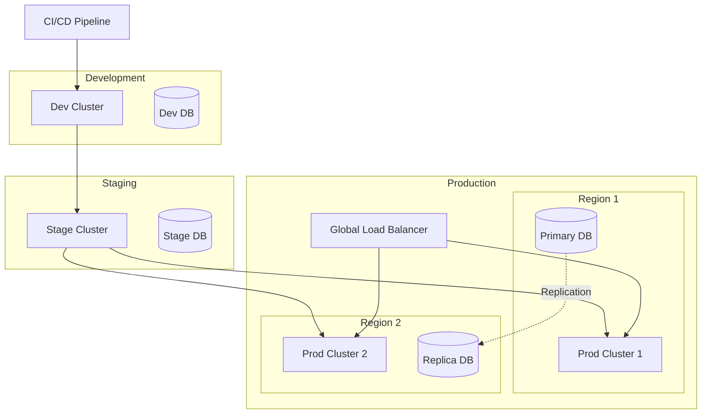

# Deployment Architecture

Production deployment patterns, infrastructure requirements, and operational procedures.

## Overview

The mExOms platform is designed for cloud-native deployment using Kubernetes with support for multi-region, high-availability configurations.

## Deployment Strategies

### 1. Container Architecture
- Docker containers for all services
- Multi-stage builds for optimization
- Security scanning in CI/CD
- Image registry management

### 2. Kubernetes Orchestration
- Helm charts for deployment
- Auto-scaling configurations
- Resource limits and requests
- Pod disruption budgets

### 3. Multi-Region Deployment
- Active-active configuration
- Cross-region replication
- Geo-distributed load balancing
- Latency-based routing

### 4. Infrastructure as Code
- Terraform modules
- GitOps workflow
- Environment promotion
- Configuration management

## Deployment Architecture Overview



## Kubernetes Deployment

### Namespace Structure

```yaml
apiVersion: v1
kind: Namespace
metadata:
  name: mexoms-prod
  labels:
    environment: production
    app: mexoms
---
apiVersion: v1
kind: ResourceQuota
metadata:
  name: mexoms-quota
  namespace: mexoms-prod
spec:
  hard:
    requests.cpu: "100"
    requests.memory: 200Gi
    limits.cpu: "200"
    limits.memory: 400Gi
    persistentvolumeclaims: "10"
    services.loadbalancers: "2"
```

### Core Service Deployment

```yaml
apiVersion: apps/v1
kind: Deployment
metadata:
  name: oms-server
  namespace: mexoms-prod
  labels:
    app: oms-server
    version: v1.0.0
spec:
  replicas: 3
  strategy:
    type: RollingUpdate
    rollingUpdate:
      maxSurge: 1
      maxUnavailable: 0
  selector:
    matchLabels:
      app: oms-server
  template:
    metadata:
      labels:
        app: oms-server
        version: v1.0.0
      annotations:
        prometheus.io/scrape: "true"
        prometheus.io/port: "9090"
    spec:
      affinity:
        podAntiAffinity:
          requiredDuringSchedulingIgnoredDuringExecution:
          - labelSelector:
              matchExpressions:
              - key: app
                operator: In
                values:
                - oms-server
            topologyKey: kubernetes.io/hostname
      
      containers:
      - name: oms-server
        image: mexoms/oms-server:v1.0.0
        ports:
        - name: grpc
          containerPort: 50051
        - name: http
          containerPort: 8080
        - name: metrics
          containerPort: 9090
        
        env:
        - name: ENV
          value: "production"
        - name: LOG_LEVEL
          value: "info"
        - name: DB_HOST
          valueFrom:
            secretKeyRef:
              name: db-credentials
              key: host
        - name: DB_PASSWORD
          valueFrom:
            secretKeyRef:
              name: db-credentials
              key: password
        
        resources:
          requests:
            cpu: 2
            memory: 4Gi
          limits:
            cpu: 4
            memory: 8Gi
        
        livenessProbe:
          httpGet:
            path: /health/live
            port: 8080
          initialDelaySeconds: 30
          periodSeconds: 10
          failureThreshold: 3
        
        readinessProbe:
          httpGet:
            path: /health/ready
            port: 8080
          initialDelaySeconds: 10
          periodSeconds: 5
          failureThreshold: 3
        
        volumeMounts:
        - name: config
          mountPath: /etc/mexoms
          readOnly: true
        - name: tls-certs
          mountPath: /etc/tls
          readOnly: true
      
      volumes:
      - name: config
        configMap:
          name: oms-config
      - name: tls-certs
        secret:
          secretName: oms-tls
```

### HorizontalPodAutoscaler

```yaml
apiVersion: autoscaling/v2
kind: HorizontalPodAutoscaler
metadata:
  name: oms-server-hpa
  namespace: mexoms-prod
spec:
  scaleTargetRef:
    apiVersion: apps/v1
    kind: Deployment
    name: oms-server
  minReplicas: 3
  maxReplicas: 20
  metrics:
  - type: Resource
    resource:
      name: cpu
      target:
        type: Utilization
        averageUtilization: 70
  - type: Resource
    resource:
      name: memory
      target:
        type: Utilization
        averageUtilization: 80
  - type: Pods
    pods:
      metric:
        name: orders_per_second
      target:
        type: AverageValue
        averageValue: "1000"
  behavior:
    scaleUp:
      stabilizationWindowSeconds: 60
      policies:
      - type: Percent
        value: 100
        periodSeconds: 60
      - type: Pods
        value: 4
        periodSeconds: 60
    scaleDown:
      stabilizationWindowSeconds: 300
      policies:
      - type: Percent
        value: 50
        periodSeconds: 60
```

### Service Mesh Configuration

```yaml
apiVersion: networking.istio.io/v1beta1
kind: VirtualService
metadata:
  name: oms-server
  namespace: mexoms-prod
spec:
  hosts:
  - oms-server
  http:
  - match:
    - headers:
        x-version:
          exact: v2
    route:
    - destination:
        host: oms-server
        subset: v2
      weight: 100
  - route:
    - destination:
        host: oms-server
        subset: v1
      weight: 90
    - destination:
        host: oms-server
        subset: v2
      weight: 10
    timeout: 30s
    retries:
      attempts: 3
      perTryTimeout: 10s
      retryOn: 5xx,reset,connect-failure,refused-stream
---
apiVersion: networking.istio.io/v1beta1
kind: DestinationRule
metadata:
  name: oms-server
  namespace: mexoms-prod
spec:
  host: oms-server
  trafficPolicy:
    connectionPool:
      tcp:
        maxConnections: 100
      http:
        http1MaxPendingRequests: 50
        h2UpgradePolicy: UPGRADE
    loadBalancer:
      consistentHash:
        httpCookie:
          name: "session"
          ttl: 3600s
    outlierDetection:
      consecutiveGatewayErrors: 5
      interval: 30s
      baseEjectionTime: 30s
      maxEjectionPercent: 50
      minHealthPercent: 50
  subsets:
  - name: v1
    labels:
      version: v1.0.0
  - name: v2
    labels:
      version: v2.0.0
```

## Infrastructure as Code

### Terraform Configuration

```hcl
# Provider configuration
provider "aws" {
  region = var.aws_region
}

provider "kubernetes" {
  host                   = module.eks.cluster_endpoint
  cluster_ca_certificate = base64decode(module.eks.cluster_ca_certificate)
  exec {
    api_version = "client.authentication.k8s.io/v1beta1"
    command     = "aws"
    args        = ["eks", "get-token", "--cluster-name", var.cluster_name]
  }
}

# EKS Cluster
module "eks" {
  source  = "terraform-aws-modules/eks/aws"
  version = "19.0.0"

  cluster_name    = var.cluster_name
  cluster_version = "1.28"

  vpc_id     = module.vpc.vpc_id
  subnet_ids = module.vpc.private_subnets

  enable_irsa = true

  eks_managed_node_group_defaults = {
    ami_type       = "AL2_x86_64"
    instance_types = ["m5.xlarge"]
    
    attach_cluster_primary_security_group = true
  }

  eks_managed_node_groups = {
    # Core nodes for system services
    system = {
      min_size     = 2
      max_size     = 4
      desired_size = 3

      instance_types = ["m5.large"]
      
      labels = {
        nodegroup = "system"
      }
      
      taints = [
        {
          key    = "system"
          value  = "true"
          effect = "NO_SCHEDULE"
        }
      ]
    }
    
    # Application nodes
    application = {
      min_size     = 3
      max_size     = 20
      desired_size = 5

      instance_types = ["m5.2xlarge"]
      
      labels = {
        nodegroup = "application"
      }
    }
    
    # High-performance nodes for trading engine
    trading = {
      min_size     = 2
      max_size     = 10
      desired_size = 3

      instance_types = ["c5n.4xlarge"]
      
      labels = {
        nodegroup = "trading"
        workload  = "cpu-intensive"
      }
      
      taints = [
        {
          key    = "trading"
          value  = "true"
          effect = "NO_SCHEDULE"
        }
      ]
    }
  }
}

# RDS for PostgreSQL
module "rds" {
  source  = "terraform-aws-modules/rds/aws"
  version = "6.0.0"

  identifier = "${var.cluster_name}-db"

  engine               = "postgres"
  engine_version       = "15.4"
  instance_class       = "db.r6g.2xlarge"
  allocated_storage    = 500
  storage_encrypted    = true
  storage_type         = "gp3"
  iops                 = 12000

  db_name  = "mexoms"
  username = "mexoms_admin"
  port     = "5432"

  multi_az               = true
  publicly_accessible    = false
  vpc_security_group_ids = [module.security_group.security_group_id]
  db_subnet_group_name   = module.vpc.database_subnet_group_name

  backup_retention_period = 30
  backup_window          = "03:00-04:00"
  maintenance_window     = "sun:04:00-sun:05:00"

  enabled_cloudwatch_logs_exports = ["postgresql"]
  create_cloudwatch_log_group     = true

  performance_insights_enabled = true
  monitoring_interval         = 60
  monitoring_role_name       = "${var.cluster_name}-rds-monitoring"
  create_monitoring_role     = true
}
```

### Helm Chart Structure

```yaml
# Chart.yaml
apiVersion: v2
name: mexoms
description: Multi-Exchange Order Management System
type: application
version: 1.0.0
appVersion: "1.0.0"

dependencies:
  - name: postgresql
    version: 12.1.0
    repository: https://charts.bitnami.com/bitnami
    condition: postgresql.enabled
    
  - name: redis
    version: 17.0.0
    repository: https://charts.bitnami.com/bitnami
    condition: redis.enabled
    
  - name: nats
    version: 0.19.0
    repository: https://nats-io.github.io/k8s/helm/charts/
    condition: nats.enabled

# values.yaml
global:
  environment: production
  imageRegistry: mexoms
  imagePullSecrets:
    - name: regcred

omsServer:
  replicaCount: 3
  image:
    repository: oms-server
    tag: v1.0.0
    pullPolicy: IfNotPresent
  
  service:
    type: ClusterIP
    grpcPort: 50051
    httpPort: 8080
  
  resources:
    requests:
      cpu: 2
      memory: 4Gi
    limits:
      cpu: 4
      memory: 8Gi
  
  autoscaling:
    enabled: true
    minReplicas: 3
    maxReplicas: 20
    targetCPUUtilizationPercentage: 70
    targetMemoryUtilizationPercentage: 80
  
  nodeSelector:
    nodegroup: application
  
  tolerations: []
  
  affinity:
    podAntiAffinity:
      requiredDuringSchedulingIgnoredDuringExecution:
      - labelSelector:
          matchExpressions:
          - key: app
            operator: In
            values:
            - oms-server
        topologyKey: kubernetes.io/hostname

tradingEngine:
  replicaCount: 2
  image:
    repository: trading-engine
    tag: v1.0.0
  
  resources:
    requests:
      cpu: 8
      memory: 16Gi
    limits:
      cpu: 16
      memory: 32Gi
  
  nodeSelector:
    nodegroup: trading
  
  tolerations:
  - key: trading
    operator: Equal
    value: "true"
    effect: NoSchedule
```

## CI/CD Pipeline

### GitLab CI Configuration

```yaml
# .gitlab-ci.yml
stages:
  - build
  - test
  - security
  - deploy-staging
  - deploy-production

variables:
  DOCKER_REGISTRY: registry.gitlab.com
  IMAGE_NAME: $DOCKER_REGISTRY/$CI_PROJECT_PATH

# Build stage
build:
  stage: build
  image: docker:latest
  services:
    - docker:dind
  script:
    - docker build -t $IMAGE_NAME:$CI_COMMIT_SHA .
    - docker tag $IMAGE_NAME:$CI_COMMIT_SHA $IMAGE_NAME:latest
    - docker push $IMAGE_NAME:$CI_COMMIT_SHA
    - docker push $IMAGE_NAME:latest
  only:
    - main
    - develop

# Test stage
test:
  stage: test
  image: golang:1.21
  script:
    - make test
    - make test-integration
  coverage: '/total:\s+\(statements\)\s+(\d+\.\d+)%/'
  artifacts:
    reports:
      coverage_report:
        coverage_format: cobertura
        path: coverage.xml

# Security scanning
security-scan:
  stage: security
  image: aquasec/trivy:latest
  script:
    - trivy image --exit-code 1 --severity HIGH,CRITICAL $IMAGE_NAME:$CI_COMMIT_SHA
  allow_failure: true

# Deploy to staging
deploy-staging:
  stage: deploy-staging
  image: bitnami/kubectl:latest
  environment:
    name: staging
    url: https://staging.mexoms.com
  script:
    - kubectl config use-context staging
    - helm upgrade --install mexoms-staging ./helm/mexoms 
        --namespace mexoms-staging 
        --set global.environment=staging 
        --set omsServer.image.tag=$CI_COMMIT_SHA
  only:
    - develop

# Deploy to production
deploy-production:
  stage: deploy-production
  image: bitnami/kubectl:latest
  environment:
    name: production
    url: https://mexoms.com
  script:
    - kubectl config use-context production
    - helm upgrade --install mexoms ./helm/mexoms 
        --namespace mexoms-prod 
        --set global.environment=production 
        --set omsServer.image.tag=$CI_COMMIT_SHA
        --atomic 
        --cleanup-on-fail
  only:
    - main
  when: manual
```

## Blue-Green Deployment

### Deployment Script

```bash
#!/bin/bash
# blue-green-deploy.sh

set -e

ENVIRONMENT=$1
VERSION=$2

if [ -z "$ENVIRONMENT" ] || [ -z "$VERSION" ]; then
    echo "Usage: $0 <environment> <version>"
    exit 1
fi

# Get current active color
CURRENT_COLOR=$(kubectl get service mexoms-active -n mexoms-$ENVIRONMENT \
    -o jsonpath='{.spec.selector.color}' 2>/dev/null || echo "blue")

# Determine new color
if [ "$CURRENT_COLOR" = "blue" ]; then
    NEW_COLOR="green"
else
    NEW_COLOR="blue"
fi

echo "Current active: $CURRENT_COLOR"
echo "Deploying to: $NEW_COLOR"

# Deploy to inactive color
helm upgrade --install mexoms-$NEW_COLOR ./helm/mexoms \
    --namespace mexoms-$ENVIRONMENT \
    --set global.environment=$ENVIRONMENT \
    --set global.deploymentColor=$NEW_COLOR \
    --set omsServer.image.tag=$VERSION \
    --wait

# Run smoke tests
echo "Running smoke tests..."
kubectl run smoke-test --rm -i --restart=Never \
    --image=mexoms/smoke-tests:latest \
    --env="TARGET=mexoms-$NEW_COLOR" \
    --namespace mexoms-$ENVIRONMENT

if [ $? -ne 0 ]; then
    echo "Smoke tests failed!"
    exit 1
fi

# Switch traffic
echo "Switching traffic to $NEW_COLOR..."
kubectl patch service mexoms-active -n mexoms-$ENVIRONMENT \
    -p '{"spec":{"selector":{"color":"'$NEW_COLOR'"}}}'

echo "Deployment complete!"
echo "Old version ($CURRENT_COLOR) is still running for rollback"
```

## Monitoring and Observability

### Prometheus Configuration

```yaml
apiVersion: v1
kind: ServiceMonitor
metadata:
  name: mexoms-metrics
  namespace: mexoms-prod
  labels:
    app: mexoms
spec:
  selector:
    matchLabels:
      app: mexoms
  endpoints:
  - port: metrics
    interval: 30s
    path: /metrics
    relabelings:
    - sourceLabels: [__meta_kubernetes_pod_name]
      targetLabel: pod
    - sourceLabels: [__meta_kubernetes_pod_node_name]
      targetLabel: node
```

### Logging Configuration

```yaml
apiVersion: v1
kind: ConfigMap
metadata:
  name: fluent-bit-config
  namespace: mexoms-prod
data:
  fluent-bit.conf: |
    [SERVICE]
        Flush         5
        Log_Level     info
        Daemon        off
    
    [INPUT]
        Name              tail
        Path              /var/log/containers/*mexoms*.log
        Parser            docker
        Tag               mexoms.*
        Refresh_Interval  5
    
    [FILTER]
        Name    kubernetes
        Match   mexoms.*
        Merge_Log On
        K8S-Logging.Parser On
        K8S-Logging.Exclude Off
    
    [OUTPUT]
        Name            es
        Match           *
        Host            ${ELASTICSEARCH_HOST}
        Port            9200
        Logstash_Format On
        Logstash_Prefix mexoms
        Retry_Limit     False
```

---

*For security considerations in deployment, see [Security Architecture](./security.md).*