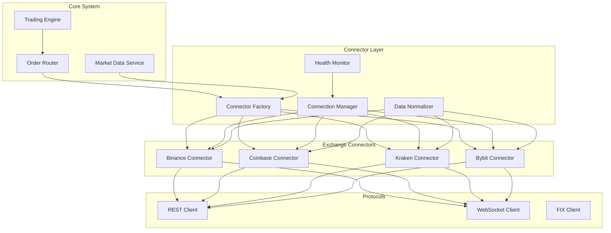

# Exchange Connector Architecture

Detailed documentation of the unified exchange interface and connector implementations.

## Overview

The Exchange Connector layer provides a unified interface for interacting with multiple cryptocurrency exchanges. Each connector implements exchange-specific protocols while exposing a common API to the rest of the system.

## Design Principles

### 1. Protocol Abstraction
- Unified interface regardless of underlying protocol (REST, WebSocket, FIX)
- Protocol-specific optimizations hidden from consumers
- Automatic protocol selection based on operation type
- Fallback mechanisms for protocol failures

### 2. Data Normalization
- Consistent symbol format across exchanges
- Unified order types and statuses
- Standardized error codes and messages
- Common timestamp formats

### 3. Resilience
- Automatic reconnection for WebSocket connections
- Exponential backoff for failed requests
- Circuit breaker pattern for exchange outages
- Rate limiting to respect exchange limits

### 4. Performance
- Connection pooling for REST endpoints
- Persistent WebSocket connections
- Local order book caching
- Batched operations where supported

## Architecture Components

### Component Diagram



## Unified Exchange Interface

### Core Interface Definition

```go
package exchange

import (
    "context"
    "time"
)

// Exchange defines the unified interface for all exchange connectors
type Exchange interface {
    // Identification
    Name() string
    ExchangeType() Type // SPOT, FUTURES, OPTIONS
    
    // Connection Management
    Connect(ctx context.Context) error
    Disconnect() error
    IsConnected() bool
    Ping(ctx context.Context) error
    
    // Market Data
    SubscribeTicker(symbols []string, callback TickerCallback) error
    SubscribeOrderBook(symbol string, depth int, callback OrderBookCallback) error
    SubscribeTrades(symbols []string, callback TradeCallback) error
    GetTicker(ctx context.Context, symbol string) (*Ticker, error)
    GetOrderBook(ctx context.Context, symbol string, depth int) (*OrderBook, error)
    GetKlines(ctx context.Context, symbol string, interval string, limit int) ([]*Kline, error)
    
    // Trading
    PlaceOrder(ctx context.Context, order *Order) (*OrderResponse, error)
    CancelOrder(ctx context.Context, symbol, orderID string) error
    ModifyOrder(ctx context.Context, modify *ModifyOrderRequest) (*OrderResponse, error)
    GetOrder(ctx context.Context, symbol, orderID string) (*Order, error)
    GetOpenOrders(ctx context.Context, symbol string) ([]*Order, error)
    GetOrderHistory(ctx context.Context, req *OrderHistoryRequest) ([]*Order, error)
    
    // Account
    GetBalances(ctx context.Context) (map[string]*Balance, error)
    GetPositions(ctx context.Context) ([]*Position, error)
    GetAccountInfo(ctx context.Context) (*AccountInfo, error)
    GetTradingFees(ctx context.Context, symbol string) (*TradingFee, error)
    
    // Exchange-Specific
    GetExchangeInfo(ctx context.Context) (*ExchangeInfo, error)
    GetServerTime(ctx context.Context) (time.Time, error)
    GetRateLimits() *RateLimits
}
```

### Data Types

```go
// Order represents a unified order structure
type Order struct {
    ID            string          `json:"id"`
    ClientID      string          `json:"client_id"`
    Symbol        string          `json:"symbol"`
    Side          Side            `json:"side"`
    Type          OrderType       `json:"type"`
    TimeInForce   TimeInForce     `json:"time_in_force"`
    Quantity      decimal.Decimal `json:"quantity"`
    Price         decimal.Decimal `json:"price,omitempty"`
    StopPrice     decimal.Decimal `json:"stop_price,omitempty"`
    Status        OrderStatus     `json:"status"`
    FilledQty     decimal.Decimal `json:"filled_qty"`
    AvgPrice      decimal.Decimal `json:"avg_price"`
    Fee           decimal.Decimal `json:"fee"`
    FeeCurrency   string          `json:"fee_currency"`
    CreateTime    time.Time       `json:"create_time"`
    UpdateTime    time.Time       `json:"update_time"`
    ReduceOnly    bool            `json:"reduce_only,omitempty"`
    PostOnly      bool            `json:"post_only,omitempty"`
    Metadata      map[string]interface{} `json:"metadata,omitempty"`
}

// Ticker represents unified market ticker data
type Ticker struct {
    Symbol       string          `json:"symbol"`
    BidPrice     decimal.Decimal `json:"bid_price"`
    BidQty       decimal.Decimal `json:"bid_qty"`
    AskPrice     decimal.Decimal `json:"ask_price"`
    AskQty       decimal.Decimal `json:"ask_qty"`
    LastPrice    decimal.Decimal `json:"last_price"`
    LastQty      decimal.Decimal `json:"last_qty"`
    OpenPrice    decimal.Decimal `json:"open_price"`
    HighPrice    decimal.Decimal `json:"high_price"`
    LowPrice     decimal.Decimal `json:"low_price"`
    Volume       decimal.Decimal `json:"volume"`
    QuoteVolume  decimal.Decimal `json:"quote_volume"`
    OpenTime     time.Time       `json:"open_time"`
    CloseTime    time.Time       `json:"close_time"`
    Count        int64           `json:"count"`
    Timestamp    time.Time       `json:"timestamp"`
}

// OrderBook represents unified order book data
type OrderBook struct {
    Symbol    string            `json:"symbol"`
    Bids      []PriceLevel      `json:"bids"`
    Asks      []PriceLevel      `json:"asks"`
    Timestamp time.Time         `json:"timestamp"`
    Sequence  int64             `json:"sequence,omitempty"`
}

type PriceLevel struct {
    Price    decimal.Decimal `json:"price"`
    Quantity decimal.Decimal `json:"quantity"`
    Count    int             `json:"count,omitempty"`
}
```

## Connector Implementation

### Base Connector

```go
// BaseConnector provides common functionality for all exchange connectors
type BaseConnector struct {
    config       *Config
    logger       *zap.Logger
    httpClient   *http.Client
    wsManager    *WebSocketManager
    rateLimiter  *RateLimiter
    reconnector  *Reconnector
    metrics      *Metrics
    
    // State
    connected    atomic.Bool
    lastError    atomic.Value
    lastPingTime atomic.Value
    
    // Callbacks
    callbacks    sync.Map // symbol -> callback
    
    // Symbol mapping
    symbolMap    map[string]string // internal -> exchange
    reverseMap   map[string]string // exchange -> internal
    
    mu sync.RWMutex
}

func (b *BaseConnector) Connect(ctx context.Context) error {
    // Initialize HTTP client
    b.httpClient = &http.Client{
        Transport: &http.Transport{
            MaxIdleConns:        100,
            MaxIdleConnsPerHost: 10,
            IdleConnTimeout:     90 * time.Second,
            TLSHandshakeTimeout: 10 * time.Second,
            ExpectContinueTimeout: 1 * time.Second,
        },
        Timeout: 30 * time.Second,
    }
    
    // Initialize WebSocket manager
    if err := b.wsManager.Connect(ctx); err != nil {
        return fmt.Errorf("websocket connect failed: %w", err)
    }
    
    // Start health monitoring
    go b.healthCheck(ctx)
    
    b.connected.Store(true)
    return nil
}

func (b *BaseConnector) request(ctx context.Context, method, endpoint string, 
    params map[string]interface{}, authenticated bool) ([]byte, error) {
    
    // Rate limiting
    if err := b.rateLimiter.Wait(ctx); err != nil {
        return nil, fmt.Errorf("rate limit exceeded: %w", err)
    }
    
    // Build request
    url := b.config.APIURL + endpoint
    req, err := b.buildRequest(method, url, params, authenticated)
    if err != nil {
        return nil, err
    }
    
    // Execute with retry
    var resp *http.Response
    err = retry.Do(
        func() error {
            resp, err = b.httpClient.Do(req)
            return err
        },
        retry.Attempts(3),
        retry.Delay(time.Second),
        retry.DelayType(retry.BackOffDelay),
        retry.OnRetry(func(n uint, err error) {
            b.logger.Warn("retrying request",
                zap.String("endpoint", endpoint),
                zap.Uint("attempt", n+1),
                zap.Error(err))
        }),
    )
    
    if err != nil {
        return nil, fmt.Errorf("request failed: %w", err)
    }
    defer resp.Body.Close()
    
    // Read response
    body, err := io.ReadAll(resp.Body)
    if err != nil {
        return nil, fmt.Errorf("read response failed: %w", err)
    }
    
    // Check status
    if resp.StatusCode != http.StatusOK {
        return nil, b.parseError(resp.StatusCode, body)
    }
    
    return body, nil
}
```

### Binance Connector

```go
type BinanceConnector struct {
    *BaseConnector
    
    listenKey    string
    orderManager *OrderManager
    marketStream *MarketDataStream
    userStream   *UserDataStream
}

func NewBinanceConnector(config *Config) *BinanceConnector {
    return &BinanceConnector{
        BaseConnector: &BaseConnector{
            config: config,
            logger: zap.L().Named("binance"),
        },
        orderManager: NewOrderManager(),
    }
}

func (b *BinanceConnector) Connect(ctx context.Context) error {
    if err := b.BaseConnector.Connect(ctx); err != nil {
        return err
    }
    
    // Get listen key for user data stream
    if err := b.createListenKey(ctx); err != nil {
        return fmt.Errorf("create listen key failed: %w", err)
    }
    
    // Connect market data stream
    marketURL := fmt.Sprintf("%s/stream", b.config.WebSocketURL)
    b.marketStream = NewMarketDataStream(marketURL, b.handleMarketMessage)
    if err := b.marketStream.Connect(ctx); err != nil {
        return fmt.Errorf("market stream connect failed: %w", err)
    }
    
    // Connect user data stream
    userURL := fmt.Sprintf("%s/ws/%s", b.config.WebSocketURL, b.listenKey)
    b.userStream = NewUserDataStream(userURL, b.handleUserMessage)
    if err := b.userStream.Connect(ctx); err != nil {
        return fmt.Errorf("user stream connect failed: %w", err)
    }
    
    // Start listen key renewal
    go b.renewListenKey(ctx)
    
    return nil
}

func (b *BinanceConnector) PlaceOrder(ctx context.Context, order *Order) (*OrderResponse, error) {
    // Validate order
    if err := b.validateOrder(order); err != nil {
        return nil, fmt.Errorf("order validation failed: %w", err)
    }
    
    // Convert to Binance format
    params := b.buildOrderParams(order)
    
    // Add signature
    b.signRequest(params)
    
    // Send request
    resp, err := b.request(ctx, "POST", "/api/v3/order", params, true)
    if err != nil {
        return nil, err
    }
    
    // Parse response
    var binanceOrder BinanceOrderResponse
    if err := json.Unmarshal(resp, &binanceOrder); err != nil {
        return nil, fmt.Errorf("parse response failed: %w", err)
    }
    
    // Convert to unified format
    return b.convertOrderResponse(&binanceOrder), nil
}

func (b *BinanceConnector) SubscribeOrderBook(symbol string, depth int, 
    callback OrderBookCallback) error {
    
    // Convert symbol
    exchangeSymbol := b.toExchangeSymbol(symbol)
    
    // Build subscription message
    sub := map[string]interface{}{
        "method": "SUBSCRIBE",
        "params": []string{
            fmt.Sprintf("%s@depth%d@100ms", strings.ToLower(exchangeSymbol), depth),
        },
        "id": time.Now().UnixNano(),
    }
    
    // Register callback
    b.callbacks.Store(exchangeSymbol+"_orderbook", callback)
    
    // Send subscription
    return b.marketStream.Subscribe(sub)
}

func (b *BinanceConnector) handleMarketMessage(msg []byte) {
    var event map[string]interface{}
    if err := json.Unmarshal(msg, &event); err != nil {
        b.logger.Error("parse market message failed", zap.Error(err))
        return
    }
    
    eventType, _ := event["e"].(string)
    
    switch eventType {
    case "depthUpdate":
        b.handleDepthUpdate(event)
    case "24hrTicker":
        b.handleTickerUpdate(event)
    case "aggTrade":
        b.handleTradeUpdate(event)
    default:
        b.logger.Debug("unknown event type", zap.String("type", eventType))
    }
}

func (b *BinanceConnector) handleDepthUpdate(event map[string]interface{}) {
    symbol := event["s"].(string)
    internalSymbol := b.toInternalSymbol(symbol)
    
    // Find callback
    if cb, ok := b.callbacks.Load(symbol + "_orderbook"); ok {
        callback := cb.(OrderBookCallback)
        
        // Convert to OrderBook
        orderbook := &OrderBook{
            Symbol:    internalSymbol,
            Timestamp: time.Now(),
            Bids:      b.parsePriceLevels(event["b"]),
            Asks:      b.parsePriceLevels(event["a"]),
        }
        
        // Call callback
        callback(orderbook)
    }
}
```

### Coinbase Connector

```go
type CoinbaseConnector struct {
    *BaseConnector
    
    auth         *CoinbaseAuth
    sequenceNum  atomic.Int64
    orderChannel chan *OrderUpdate
}

func (c *CoinbaseConnector) PlaceOrder(ctx context.Context, order *Order) (*OrderResponse, error) {
    // Build Coinbase order
    cbOrder := &CoinbaseOrderRequest{
        ProductID:  c.toExchangeSymbol(order.Symbol),
        Side:       c.translateSide(order.Side),
        Type:       c.translateOrderType(order.Type),
        Size:       order.Quantity.String(),
        TimeInForce: c.translateTimeInForce(order.TimeInForce),
    }
    
    if order.Type == OrderTypeLIMIT {
        cbOrder.Price = order.Price.String()
    }
    
    // Send via WebSocket for lower latency
    if c.wsManager.IsConnected() {
        return c.placeOrderWebSocket(ctx, cbOrder)
    }
    
    // Fallback to REST
    return c.placeOrderREST(ctx, cbOrder)
}

func (c *CoinbaseConnector) placeOrderWebSocket(ctx context.Context, 
    order *CoinbaseOrderRequest) (*OrderResponse, error) {
    
    // Generate order ID
    orderID := uuid.New().String()
    
    // Build WebSocket message
    msg := map[string]interface{}{
        "type":       "order",
        "order_id":   orderID,
        "product_id": order.ProductID,
        "side":       order.Side,
        "order_type": order.Type,
        "size":       order.Size,
    }
    
    if order.Type == "limit" {
        msg["price"] = order.Price
    }
    
    // Sign message
    c.signWebSocketMessage(msg)
    
    // Create response channel
    respChan := make(chan *OrderResponse, 1)
    c.pendingOrders.Store(orderID, respChan)
    
    // Send message
    if err := c.wsManager.Send(msg); err != nil {
        c.pendingOrders.Delete(orderID)
        return nil, err
    }
    
    // Wait for response
    select {
    case resp := <-respChan:
        return resp, nil
    case <-ctx.Done():
        c.pendingOrders.Delete(orderID)
        return nil, ctx.Err()
    case <-time.After(5 * time.Second):
        c.pendingOrders.Delete(orderID)
        return nil, ErrTimeout
    }
}
```

## Connection Management

### WebSocket Management

```go
type WebSocketManager struct {
    url          string
    conn         *websocket.Conn
    handler      MessageHandler
    
    // Configuration
    pingInterval time.Duration
    pongTimeout  time.Duration
    reconnectMax int
    
    // State
    connected    atomic.Bool
    reconnecting atomic.Bool
    reconnectNum atomic.Int32
    lastPong     atomic.Value
    
    // Channels
    send         chan []byte
    done         chan struct{}
    
    logger       *zap.Logger
}

func (w *WebSocketManager) Connect(ctx context.Context) error {
    dialer := websocket.Dialer{
        Proxy:            http.ProxyFromEnvironment,
        HandshakeTimeout: 10 * time.Second,
        ReadBufferSize:   1024 * 16,
        WriteBufferSize:  1024 * 16,
    }
    
    conn, _, err := dialer.DialContext(ctx, w.url, nil)
    if err != nil {
        return fmt.Errorf("websocket dial failed: %w", err)
    }
    
    w.conn = conn
    w.connected.Store(true)
    w.reconnectNum.Store(0)
    
    // Configure connection
    w.conn.SetReadDeadline(time.Now().Add(w.pongTimeout))
    w.conn.SetPongHandler(func(string) error {
        w.lastPong.Store(time.Now())
        w.conn.SetReadDeadline(time.Now().Add(w.pongTimeout))
        return nil
    })
    
    // Start workers
    go w.readPump()
    go w.writePump()
    go w.pingPump()
    
    return nil
}

func (w *WebSocketManager) readPump() {
    defer func() {
        w.connected.Store(false)
        w.conn.Close()
        close(w.done)
    }()
    
    for {
        messageType, message, err := w.conn.ReadMessage()
        if err != nil {
            if websocket.IsUnexpectedCloseError(err, 
                websocket.CloseGoingAway, 
                websocket.CloseAbnormalClosure) {
                w.logger.Error("websocket read error", zap.Error(err))
            }
            break
        }
        
        if messageType == websocket.TextMessage {
            w.handler(message)
        }
    }
    
    // Trigger reconnection
    if w.reconnecting.CompareAndSwap(false, true) {
        go w.reconnect()
    }
}

func (w *WebSocketManager) reconnect() {
    defer w.reconnecting.Store(false)
    
    for w.reconnectNum.Load() < int32(w.reconnectMax) {
        wait := time.Duration(math.Pow(2, float64(w.reconnectNum.Load()))) * time.Second
        if wait > time.Minute {
            wait = time.Minute
        }
        
        w.logger.Info("reconnecting websocket",
            zap.Duration("wait", wait),
            zap.Int32("attempt", w.reconnectNum.Load()+1))
        
        time.Sleep(wait)
        
        ctx, cancel := context.WithTimeout(context.Background(), 10*time.Second)
        err := w.Connect(ctx)
        cancel()
        
        if err == nil {
            w.logger.Info("websocket reconnected")
            return
        }
        
        w.reconnectNum.Add(1)
    }
    
    w.logger.Error("websocket reconnection failed", 
        zap.Int("max_attempts", w.reconnectMax))
}
```

### Rate Limiting

```go
type RateLimiter struct {
    limits      map[string]*Limit
    buckets     map[string]*TokenBucket
    mu          sync.RWMutex
}

type Limit struct {
    Requests int
    Period   time.Duration
    Burst    int
}

type TokenBucket struct {
    tokens   float64
    capacity float64
    rate     float64
    lastTime time.Time
    mu       sync.Mutex
}

func (r *RateLimiter) Wait(ctx context.Context, endpoint string) error {
    r.mu.RLock()
    limit, ok := r.limits[endpoint]
    if !ok {
        limit = r.limits["default"]
    }
    bucket, ok := r.buckets[endpoint]
    if !ok {
        bucket = r.buckets["default"]
    }
    r.mu.RUnlock()
    
    return bucket.Wait(ctx, 1)
}

func (b *TokenBucket) Wait(ctx context.Context, tokens float64) error {
    b.mu.Lock()
    defer b.mu.Unlock()
    
    // Update tokens
    now := time.Now()
    elapsed := now.Sub(b.lastTime).Seconds()
    b.tokens = math.Min(b.capacity, b.tokens+elapsed*b.rate)
    b.lastTime = now
    
    // Check if enough tokens
    if b.tokens >= tokens {
        b.tokens -= tokens
        return nil
    }
    
    // Calculate wait time
    waitTime := time.Duration((tokens-b.tokens)/b.rate) * time.Second
    
    // Wait with context
    timer := time.NewTimer(waitTime)
    defer timer.Stop()
    
    select {
    case <-ctx.Done():
        return ctx.Err()
    case <-timer.C:
        b.tokens = 0
        return nil
    }
}
```

## Error Handling

### Error Types

```go
type ExchangeError struct {
    Code       string
    Message    string
    Exchange   string
    HTTPStatus int
    Retryable  bool
    Details    map[string]interface{}
}

func (e *ExchangeError) Error() string {
    return fmt.Sprintf("%s error %s: %s", e.Exchange, e.Code, e.Message)
}

// Common error codes
const (
    ErrCodeInsufficientBalance = "INSUFFICIENT_BALANCE"
    ErrCodeOrderNotFound      = "ORDER_NOT_FOUND"
    ErrCodeInvalidSymbol      = "INVALID_SYMBOL"
    ErrCodeInvalidQuantity    = "INVALID_QUANTITY"
    ErrCodeInvalidPrice       = "INVALID_PRICE"
    ErrCodeRateLimitExceeded  = "RATE_LIMIT_EXCEEDED"
    ErrCodeExchangeOffline    = "EXCHANGE_OFFLINE"
    ErrCodeInvalidAPIKey      = "INVALID_API_KEY"
    ErrCodePermissionDenied   = "PERMISSION_DENIED"
)

// Error mapping for each exchange
var binanceErrorMap = map[int]string{
    -1000: ErrCodeExchangeOffline,
    -1021: ErrCodeInvalidTimestamp,
    -1022: ErrCodeInvalidSignature,
    -2010: ErrCodeInsufficientBalance,
    -2011: ErrCodeOrderNotFound,
    -1121: ErrCodeInvalidSymbol,
    -1100: ErrCodeInvalidQuantity,
    -1101: ErrCodeInvalidPrice,
    -1003: ErrCodeRateLimitExceeded,
}
```

### Error Recovery

```go
type ErrorRecovery struct {
    maxRetries   int
    retryDelays  []time.Duration
    circuitBreaker *CircuitBreaker
}

func (e *ErrorRecovery) Execute(ctx context.Context, 
    fn func() error) error {
    
    var lastErr error
    
    for attempt := 0; attempt <= e.maxRetries; attempt++ {
        // Check circuit breaker
        if !e.circuitBreaker.Allow() {
            return ErrCircuitBreakerOpen
        }
        
        // Execute function
        err := fn()
        
        // Success
        if err == nil {
            e.circuitBreaker.RecordSuccess()
            return nil
        }
        
        // Check if retryable
        var exchErr *ExchangeError
        if errors.As(err, &exchErr) {
            if !exchErr.Retryable {
                e.circuitBreaker.RecordFailure()
                return err
            }
        }
        
        lastErr = err
        
        // Wait before retry
        if attempt < e.maxRetries {
            delay := e.retryDelays[min(attempt, len(e.retryDelays)-1)]
            
            select {
            case <-ctx.Done():
                return ctx.Err()
            case <-time.After(delay):
                // Continue to next attempt
            }
        }
    }
    
    e.circuitBreaker.RecordFailure()
    return fmt.Errorf("max retries exceeded: %w", lastErr)
}
```

## Performance Optimization

### Connection Pooling

```go
type ConnectionPool struct {
    connections chan *Connection
    factory     ConnectionFactory
    validator   ConnectionValidator
    
    minSize     int
    maxSize     int
    idleTimeout time.Duration
    
    mu          sync.Mutex
    closed      bool
}

func (p *ConnectionPool) Get(ctx context.Context) (*Connection, error) {
    select {
    case conn := <-p.connections:
        // Validate connection
        if p.validator(conn) {
            return conn, nil
        }
        // Invalid connection, create new one
        return p.create(ctx)
        
    default:
        // No available connection, create new one
        return p.create(ctx)
    }
}

func (p *ConnectionPool) Put(conn *Connection) error {
    if p.closed {
        return conn.Close()
    }
    
    select {
    case p.connections <- conn:
        return nil
    default:
        // Pool full, close connection
        return conn.Close()
    }
}
```

### Message Batching

```go
type MessageBatcher struct {
    batchSize    int
    batchTimeout time.Duration
    sender       MessageSender
    
    buffer       []Message
    timer        *time.Timer
    mu           sync.Mutex
}

func (b *MessageBatcher) Add(msg Message) error {
    b.mu.Lock()
    defer b.mu.Unlock()
    
    b.buffer = append(b.buffer, msg)
    
    // Send immediately if batch full
    if len(b.buffer) >= b.batchSize {
        return b.flush()
    }
    
    // Start timer for first message
    if len(b.buffer) == 1 {
        b.timer = time.AfterFunc(b.batchTimeout, func() {
            b.mu.Lock()
            defer b.mu.Unlock()
            b.flush()
        })
    }
    
    return nil
}

func (b *MessageBatcher) flush() error {
    if len(b.buffer) == 0 {
        return nil
    }
    
    // Stop timer
    if b.timer != nil {
        b.timer.Stop()
        b.timer = nil
    }
    
    // Send batch
    err := b.sender.SendBatch(b.buffer)
    
    // Clear buffer
    b.buffer = b.buffer[:0]
    
    return err
}
```

## Monitoring and Metrics

### Connector Metrics

```go
var (
    // Connection metrics
    connectionsActive = promauto.NewGaugeVec(
        prometheus.GaugeOpts{
            Name: "exchange_connections_active",
            Help: "Number of active connections to exchange",
        },
        []string{"exchange", "type"},
    )
    
    // Order metrics
    ordersTotal = promauto.NewCounterVec(
        prometheus.CounterOpts{
            Name: "exchange_orders_total",
            Help: "Total number of orders sent to exchange",
        },
        []string{"exchange", "status"},
    )
    
    orderLatency = promauto.NewHistogramVec(
        prometheus.HistogramOpts{
            Name: "exchange_order_latency_seconds",
            Help: "Order placement latency",
            Buckets: prometheus.ExponentialBuckets(0.001, 2, 10),
        },
        []string{"exchange", "method"},
    )
    
    // Data metrics
    messagesReceived = promauto.NewCounterVec(
        prometheus.CounterOpts{
            Name: "exchange_messages_received_total",
            Help: "Total number of messages received from exchange",
        },
        []string{"exchange", "type"},
    )
    
    // Error metrics
    errorsTotal = promauto.NewCounterVec(
        prometheus.CounterOpts{
            Name: "exchange_errors_total",
            Help: "Total number of exchange errors",
        },
        []string{"exchange", "error_code"},
    )
)
```

### Health Monitoring

```go
type HealthMonitor struct {
    connectors  map[string]Exchange
    interval    time.Duration
    alerts      AlertManager
    
    mu          sync.RWMutex
}

func (h *HealthMonitor) Start(ctx context.Context) {
    ticker := time.NewTicker(h.interval)
    defer ticker.Stop()
    
    for {
        select {
        case <-ctx.Done():
            return
        case <-ticker.C:
            h.checkHealth()
        }
    }
}

func (h *HealthMonitor) checkHealth() {
    h.mu.RLock()
    defer h.mu.RUnlock()
    
    for name, connector := range h.connectors {
        go func(name string, conn Exchange) {
            ctx, cancel := context.WithTimeout(context.Background(), 5*time.Second)
            defer cancel()
            
            // Check connection
            if !conn.IsConnected() {
                h.alerts.Send(Alert{
                    Level:    AlertLevelWarning,
                    Exchange: name,
                    Message:  "Exchange disconnected",
                })
                return
            }
            
            // Ping test
            if err := conn.Ping(ctx); err != nil {
                h.alerts.Send(Alert{
                    Level:    AlertLevelError,
                    Exchange: name,
                    Message:  fmt.Sprintf("Ping failed: %v", err),
                })
            }
        }(name, connector)
    }
}
```

## Testing

### Mock Exchange

```go
type MockExchange struct {
    name         string
    connected    bool
    orders       sync.Map
    orderbooks   sync.Map
    balances     map[string]*Balance
    
    // Behavior control
    latency      time.Duration
    errorRate    float64
    
    mu           sync.RWMutex
}

func (m *MockExchange) PlaceOrder(ctx context.Context, order *Order) (*OrderResponse, error) {
    // Simulate latency
    if m.latency > 0 {
        time.Sleep(m.latency)
    }
    
    // Simulate errors
    if rand.Float64() < m.errorRate {
        return nil, &ExchangeError{
            Code:    ErrCodeInsufficientBalance,
            Message: "Simulated error",
            Exchange: m.name,
        }
    }
    
    // Generate order ID
    orderID := uuid.New().String()
    
    // Store order
    m.orders.Store(orderID, order)
    
    return &OrderResponse{
        OrderID:   orderID,
        ClientID:  order.ClientID,
        Status:    OrderStatusNew,
        Timestamp: time.Now(),
    }, nil
}
```

---

*This document provides detailed architecture of exchange connectors. For order routing strategies, see [Order Router Design](./order-router.md).*