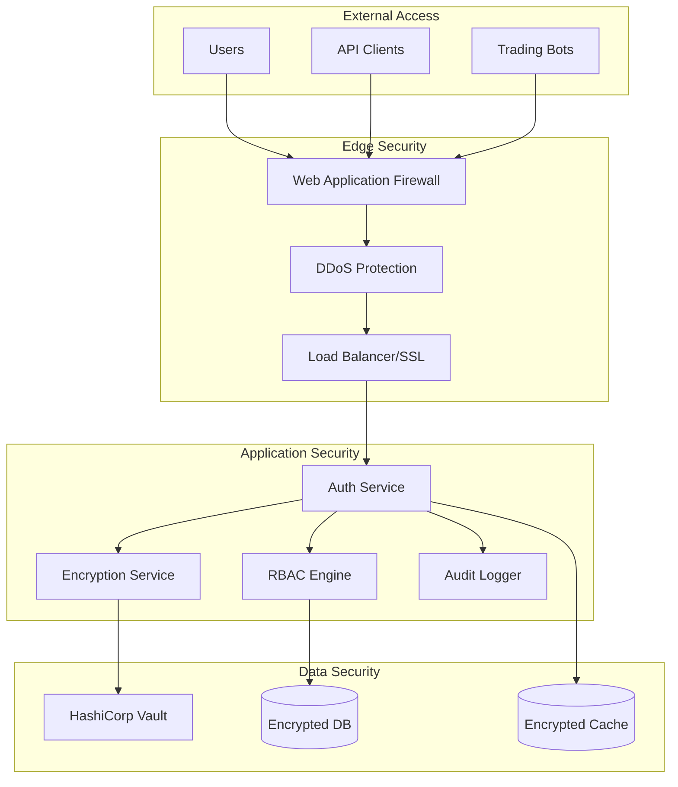

# Security Architecture

Comprehensive security model covering authentication, authorization, encryption, and compliance.

## Overview

Security is implemented at every layer of the mExOms platform, from network security to application-level controls.

## Security Layers

### 1. Network Security
- Private VPC with isolated subnets
- Web Application Firewall (WAF)
- DDoS protection
- SSL/TLS encryption
- VPN access for administration

### 2. Authentication & Authorization
- Multi-factor authentication (MFA)
- OAuth2/OpenID Connect
- API key management
- Role-based access control (RBAC)
- Session management

### 3. Data Security
- Encryption at rest (AES-256)
- Encryption in transit (TLS 1.3)
- Key management with HashiCorp Vault
- Secure key rotation
- Data masking and tokenization

### 4. Application Security
- Input validation and sanitization
- SQL injection prevention
- XSS protection
- CSRF tokens
- Security headers

## Security Architecture Overview



## Authentication & Authorization

### JWT Token Implementation

```go
type JWTManager struct {
    signingKey    []byte
    issuer        string
    audience      string
    tokenDuration time.Duration
}

type Claims struct {
    jwt.RegisteredClaims
    UserID      string   `json:"uid"`
    Email       string   `json:"email"`
    Roles       []string `json:"roles"`
    Permissions []string `json:"permissions"`
    AccountIDs  []string `json:"accounts"`
}

func (jm *JWTManager) GenerateToken(user *User) (string, error) {
    now := time.Now()
    
    claims := &Claims{
        RegisteredClaims: jwt.RegisteredClaims{
            Issuer:    jm.issuer,
            Subject:   user.ID,
            Audience:  jwt.ClaimStrings{jm.audience},
            ExpiresAt: jwt.NewNumericDate(now.Add(jm.tokenDuration)),
            NotBefore: jwt.NewNumericDate(now),
            IssuedAt:  jwt.NewNumericDate(now),
            ID:        uuid.New().String(),
        },
        UserID:      user.ID,
        Email:       user.Email,
        Roles:       user.Roles,
        Permissions: user.GetPermissions(),
        AccountIDs:  user.GetAccountIDs(),
    }
    
    token := jwt.NewWithClaims(jwt.SigningMethodHS512, claims)
    return token.SignedString(jm.signingKey)
}

func (jm *JWTManager) ValidateToken(tokenString string) (*Claims, error) {
    token, err := jwt.ParseWithClaims(
        tokenString,
        &Claims{},
        func(token *jwt.Token) (interface{}, error) {
            if _, ok := token.Method.(*jwt.SigningMethodHMAC); !ok {
                return nil, fmt.Errorf("unexpected signing method")
            }
            return jm.signingKey, nil
        },
    )
    
    if err != nil {
        return nil, err
    }
    
    claims, ok := token.Claims.(*Claims)
    if !ok || !token.Valid {
        return nil, ErrInvalidToken
    }
    
    // Additional validation
    if !claims.VerifyAudience(jm.audience, true) {
        return nil, ErrInvalidAudience
    }
    
    if !claims.VerifyIssuer(jm.issuer, true) {
        return nil, ErrInvalidIssuer
    }
    
    return claims, nil
}
```

### Role-Based Access Control (RBAC)

```go
type RBACManager struct {
    roles       map[string]*Role
    permissions map[string]*Permission
    mu          sync.RWMutex
}

type Role struct {
    ID          string
    Name        string
    Description string
    Permissions []string
    Inherits    []string // Role inheritance
}

type Permission struct {
    ID          string
    Resource    string
    Actions     []string
    Conditions  map[string]interface{}
}

// Permission definitions
var (
    // Trading permissions
    PermTradingRead   = "trading:read"
    PermTradingCreate = "trading:create"
    PermTradingCancel = "trading:cancel"
    PermTradingModify = "trading:modify"
    
    // Account permissions
    PermAccountRead   = "account:read"
    PermAccountCreate = "account:create"
    PermAccountUpdate = "account:update"
    PermAccountDelete = "account:delete"
    
    // Admin permissions
    PermAdminUsers    = "admin:users"
    PermAdminSettings = "admin:settings"
    PermAdminSecurity = "admin:security"
)

// Default roles
var defaultRoles = map[string]*Role{
    "admin": {
        Name:        "Administrator",
        Permissions: []string{"*"}, // All permissions
    },
    "trader": {
        Name: "Trader",
        Permissions: []string{
            PermTradingRead,
            PermTradingCreate,
            PermTradingCancel,
            PermAccountRead,
        },
    },
    "viewer": {
        Name: "Viewer",
        Permissions: []string{
            PermTradingRead,
            PermAccountRead,
        },
    },
}

func (r *RBACManager) CheckPermission(ctx context.Context, 
    userID string, resource string, action string) error {
    
    claims := GetClaimsFromContext(ctx)
    if claims == nil {
        return ErrUnauthorized
    }
    
    // Super admin check
    if contains(claims.Roles, "admin") {
        return nil
    }
    
    // Build required permission
    requiredPerm := fmt.Sprintf("%s:%s", resource, action)
    
    // Check user permissions
    if contains(claims.Permissions, requiredPerm) {
        return nil
    }
    
    // Check role permissions
    for _, roleID := range claims.Roles {
        role := r.roles[roleID]
        if role != nil && r.roleHasPermission(role, requiredPerm) {
            return nil
        }
    }
    
    return ErrForbidden
}
```

### API Key Management

```go
type APIKeyManager struct {
    store       KeyStore
    hasher      hash.Hash
    rateLimiter *RateLimiter
}

type APIKey struct {
    ID          string
    UserID      string
    Name        string
    KeyHash     string
    Permissions []string
    RateLimit   int
    ExpiresAt   *time.Time
    LastUsedAt  *time.Time
    CreatedAt   time.Time
}

func (akm *APIKeyManager) CreateAPIKey(userID string, 
    name string, permissions []string) (*APIKey, string, error) {
    
    // Generate secure random key
    rawKey := make([]byte, 32)
    if _, err := rand.Read(rawKey); err != nil {
        return nil, "", err
    }
    
    // Format: mex_live_<base64>
    keyString := fmt.Sprintf("mex_live_%s", 
        base64.URLEncoding.EncodeToString(rawKey))
    
    // Hash the key for storage
    h := sha256.New()
    h.Write([]byte(keyString))
    keyHash := hex.EncodeToString(h.Sum(nil))
    
    apiKey := &APIKey{
        ID:          uuid.New().String(),
        UserID:      userID,
        Name:        name,
        KeyHash:     keyHash,
        Permissions: permissions,
        RateLimit:   1000, // Default 1000 req/hour
        CreatedAt:   time.Now(),
    }
    
    if err := akm.store.SaveAPIKey(apiKey); err != nil {
        return nil, "", err
    }
    
    // Return key only once
    return apiKey, keyString, nil
}

func (akm *APIKeyManager) ValidateAPIKey(keyString string) (*APIKey, error) {
    // Hash the provided key
    h := sha256.New()
    h.Write([]byte(keyString))
    keyHash := hex.EncodeToString(h.Sum(nil))
    
    // Look up key
    apiKey, err := akm.store.GetAPIKeyByHash(keyHash)
    if err != nil {
        return nil, ErrInvalidAPIKey
    }
    
    // Check expiration
    if apiKey.ExpiresAt != nil && time.Now().After(*apiKey.ExpiresAt) {
        return nil, ErrAPIKeyExpired
    }
    
    // Rate limiting
    if !akm.rateLimiter.Allow(apiKey.ID, apiKey.RateLimit) {
        return nil, ErrRateLimitExceeded
    }
    
    // Update last used
    now := time.Now()
    apiKey.LastUsedAt = &now
    akm.store.UpdateAPIKey(apiKey)
    
    return apiKey, nil
}
```

## Data Encryption

### Encryption Service

```go
type EncryptionService struct {
    keyManager *KeyManager
    vault      *VaultClient
}

// AES-256-GCM encryption
func (es *EncryptionService) Encrypt(plaintext []byte, 
    keyID string) ([]byte, error) {
    
    // Get encryption key from Vault
    key, err := es.vault.GetKey(keyID)
    if err != nil {
        return nil, err
    }
    
    // Generate nonce
    nonce := make([]byte, 12)
    if _, err := rand.Read(nonce); err != nil {
        return nil, err
    }
    
    // Create cipher
    block, err := aes.NewCipher(key)
    if err != nil {
        return nil, err
    }
    
    aesGCM, err := cipher.NewGCM(block)
    if err != nil {
        return nil, err
    }
    
    // Encrypt
    ciphertext := aesGCM.Seal(nil, nonce, plaintext, nil)
    
    // Prepend nonce to ciphertext
    return append(nonce, ciphertext...), nil
}

func (es *EncryptionService) Decrypt(ciphertext []byte, 
    keyID string) ([]byte, error) {
    
    if len(ciphertext) < 12 {
        return nil, ErrInvalidCiphertext
    }
    
    // Extract nonce
    nonce := ciphertext[:12]
    ciphertext = ciphertext[12:]
    
    // Get decryption key
    key, err := es.vault.GetKey(keyID)
    if err != nil {
        return nil, err
    }
    
    // Create cipher
    block, err := aes.NewCipher(key)
    if err != nil {
        return nil, err
    }
    
    aesGCM, err := cipher.NewGCM(block)
    if err != nil {
        return nil, err
    }
    
    // Decrypt
    return aesGCM.Open(nil, nonce, ciphertext, nil)
}
```

### Database Encryption

```sql
-- Enable encryption at rest
ALTER SYSTEM SET ssl = on;
ALTER SYSTEM SET ssl_cert_file = '/etc/postgresql/server.crt';
ALTER SYSTEM SET ssl_key_file = '/etc/postgresql/server.key';
ALTER SYSTEM SET ssl_ca_file = '/etc/postgresql/ca.crt';

-- Create encrypted tablespace
CREATE TABLESPACE encrypted_data
  LOCATION '/encrypted/data'
  WITH (encryption_key_id = 'vault:v1:base64key...');

-- Move sensitive tables
ALTER TABLE users SET TABLESPACE encrypted_data;
ALTER TABLE api_keys SET TABLESPACE encrypted_data;
ALTER TABLE orders SET TABLESPACE encrypted_data;
```

### Field-Level Encryption

```go
type EncryptedField struct {
    Version    int    `json:"v"`
    KeyID      string `json:"kid"`
Ciphertext string `json:"ct"`
}

// Custom Scanner for encrypted fields
func (ef *EncryptedField) Scan(value interface{}) error {
    if value == nil {
        return nil
    }
    
    bytes, ok := value.([]byte)
    if !ok {
        return errors.New("invalid encrypted field type")
    }
    
    return json.Unmarshal(bytes, ef)
}

// Example usage in model
type User struct {
    ID            string
    Email         string
    PasswordHash  EncryptedField `gorm:"type:jsonb"`
    MFASecret     EncryptedField `gorm:"type:jsonb"`
    PersonalData  EncryptedField `gorm:"type:jsonb"`
}
```

## Network Security

### TLS Configuration

```go
func CreateTLSConfig() *tls.Config {
    return &tls.Config{
        MinVersion: tls.VersionTLS13,
        CipherSuites: []uint16{
            tls.TLS_AES_256_GCM_SHA384,
            tls.TLS_CHACHA20_POLY1305_SHA256,
            tls.TLS_AES_128_GCM_SHA256,
        },
        CurvePreferences: []tls.CurveID{
            tls.X25519,
            tls.CurveP256,
        },
        SessionTicketsDisabled: false,
        Renegotiation:         tls.RenegotiateNever,
    }
}

// mTLS for service-to-service
func CreateMTLSConfig(certFile, keyFile, caFile string) (*tls.Config, error) {
    cert, err := tls.LoadX509KeyPair(certFile, keyFile)
    if err != nil {
        return nil, err
    }
    
    caCert, err := os.ReadFile(caFile)
    if err != nil {
        return nil, err
    }
    
    caCertPool := x509.NewCertPool()
    caCertPool.AppendCertsFromPEM(caCert)
    
    return &tls.Config{
        MinVersion:   tls.VersionTLS13,
        Certificates: []tls.Certificate{cert},
        ClientAuth:   tls.RequireAndVerifyClientCert,
        ClientCAs:    caCertPool,
        RootCAs:      caCertPool,
    }, nil
}
```

### Security Headers

```go
func SecurityHeadersMiddleware(next http.Handler) http.Handler {
    return http.HandlerFunc(func(w http.ResponseWriter, r *http.Request) {
        // Security headers
        w.Header().Set("X-Content-Type-Options", "nosniff")
        w.Header().Set("X-Frame-Options", "DENY")
        w.Header().Set("X-XSS-Protection", "1; mode=block")
        w.Header().Set("Strict-Transport-Security", 
            "max-age=63072000; includeSubDomains; preload")
        w.Header().Set("Content-Security-Policy", 
            "default-src 'self'; script-src 'self' 'unsafe-inline' 'unsafe-eval'; style-src 'self' 'unsafe-inline';")
        w.Header().Set("Referrer-Policy", "strict-origin-when-cross-origin")
        w.Header().Set("Permissions-Policy", 
            "accelerometer=(), camera=(), geolocation=(), gyroscope=(), magnetometer=(), microphone=(), payment=(), usb=()")
        
        // Remove sensitive headers
        w.Header().Del("X-Powered-By")
        w.Header().Del("Server")
        
        next.ServeHTTP(w, r)
    })
}
```

## Input Validation

### Request Validation

```go
type Validator struct {
    validate *validator.Validate
}

func NewValidator() *Validator {
    v := validator.New()
    
    // Custom validations
    v.RegisterValidation("symbol", validateSymbol)
    v.RegisterValidation("ordertype", validateOrderType)
    v.RegisterValidation("decimal", validateDecimal)
    
    return &Validator{validate: v}
}

// Order validation example
type CreateOrderRequest struct {
    Symbol      string          `json:"symbol" validate:"required,symbol"`
    Side        string          `json:"side" validate:"required,oneof=BUY SELL"`
    Type        string          `json:"type" validate:"required,ordertype"`
    Quantity    decimal.Decimal `json:"quantity" validate:"required,decimal,gt=0"`
    Price       decimal.Decimal `json:"price" validate:"decimal,gt=0"`
    TimeInForce string          `json:"time_in_force" validate:"oneof=GTC IOC FOK"`
}

func validateSymbol(fl validator.FieldLevel) bool {
    symbol := fl.Field().String()
    // Symbol format: BASE-QUOTE
    matched, _ := regexp.MatchString(`^[A-Z]{2,10}-[A-Z]{2,10}$`, symbol)
    return matched
}

func validateDecimal(fl validator.FieldLevel) bool {
    // Ensure decimal is valid and not infinite
    d := fl.Field().Interface().(decimal.Decimal)
    return !d.IsZero() && d.Exponent() >= -8
}
```

### SQL Injection Prevention

```go
// Always use parameterized queries
func GetOrdersByUser(db *sql.DB, userID string) ([]*Order, error) {
    query := `
        SELECT o.* FROM orders o
        JOIN accounts a ON o.account_id = a.id
        WHERE a.user_id = $1
        ORDER BY o.created_at DESC
        LIMIT 100
    `
    
    rows, err := db.Query(query, userID) // Safe: parameterized
    if err != nil {
        return nil, err
    }
    defer rows.Close()
    
    // ... scan results
}

// For dynamic queries, use query builders
func BuildOrderQuery(filters map[string]interface{}) (string, []interface{}) {
    qb := sqlbuilder.PostgreSQL.NewSelectBuilder()
    qb.Select("*").From("orders")
    
    args := []interface{}{}
    argIndex := 1
    
    for key, value := range filters {
        switch key {
        case "symbol":
            qb.Where(qb.Equal("symbol", qb.Var(argIndex)))
            args = append(args, value)
            argIndex++
        case "status":
            qb.Where(qb.Equal("status", qb.Var(argIndex)))
            args = append(args, value)
            argIndex++
        // ... other filters
        }
    }
    
    sql, _ := qb.BuildWithFlavor(sqlbuilder.PostgreSQL)
    return sql, args
}
```

## Audit Logging

### Audit Logger Implementation

```go
type AuditLogger struct {
    db          *sql.DB
    eventQueue  chan *AuditEvent
    encryptor   *EncryptionService
}

type AuditEvent struct {
    ID          string
    Timestamp   time.Time
    UserID      string
    SessionID   string
    Action      string
    Resource    string
    ResourceID  string
    Result      string
    IPAddress   string
    UserAgent   string
    Details     map[string]interface{}
}

func (al *AuditLogger) LogEvent(event *AuditEvent) {
    // Async logging
    select {
    case al.eventQueue <- event:
    default:
        // Queue full, log error
        log.Error("Audit queue full, event dropped")
    }
}

func (al *AuditLogger) processEvents() {
    batch := make([]*AuditEvent, 0, 100)
    ticker := time.NewTicker(time.Second)
    
    for {
        select {
        case event := <-al.eventQueue:
            batch = append(batch, event)
            
            if len(batch) >= 100 {
                al.writeBatch(batch)
                batch = batch[:0]
            }
            
        case <-ticker.C:
            if len(batch) > 0 {
                al.writeBatch(batch)
                batch = batch[:0]
            }
        }
    }
}

func (al *AuditLogger) writeBatch(events []*AuditEvent) error {
    tx, err := al.db.Begin()
    if err != nil {
        return err
    }
    defer tx.Rollback()
    
    stmt, err := tx.Prepare(`
        INSERT INTO audit_log 
        (id, timestamp, user_id, session_id, action, resource, 
         resource_id, result, ip_address, user_agent, details)
        VALUES ($1, $2, $3, $4, $5, $6, $7, $8, $9, $10, $11)
    `)
    if err != nil {
        return err
    }
    defer stmt.Close()
    
    for _, event := range events {
        // Encrypt sensitive details
        detailsJSON, _ := json.Marshal(event.Details)
        encryptedDetails, _ := al.encryptor.Encrypt(detailsJSON, "audit-key")
        
        _, err := stmt.Exec(
            event.ID,
            event.Timestamp,
            event.UserID,
            event.SessionID,
            event.Action,
            event.Resource,
            event.ResourceID,
            event.Result,
            event.IPAddress,
            event.UserAgent,
            encryptedDetails,
        )
        if err != nil {
            log.Errorf("Failed to write audit event: %v", err)
        }
    }
    
    return tx.Commit()
}
```

## Security Configuration

### Security Settings

```yaml
security:
  # Authentication
  auth:
    jwt_secret: "${VAULT:secret/data/mexoms/jwt#secret}"
    jwt_issuer: "mexoms.com"
    jwt_audience: "mexoms-api"
    token_duration: 15m
    refresh_duration: 7d
    
    # MFA
    mfa_required: true
    mfa_issuer: "mExOms"
    
  # Session management
  sessions:
    timeout: 30m
    max_concurrent: 5
    secure_cookie: true
    same_site: "strict"
    
  # API keys
  api_keys:
    max_per_user: 10
    default_rate_limit: 1000
    rotation_days: 90
    
  # Password policy
  password:
    min_length: 12
    require_uppercase: true
    require_lowercase: true
    require_numbers: true
    require_symbols: true
    history_count: 5
    max_age_days: 90
    
  # Rate limiting
  rate_limits:
    login_attempts: 5
    login_window: 15m
    api_requests: 1000
    api_window: 1h
    
  # IP restrictions
  ip_whitelist:
    enabled: false
    ranges:
      - "10.0.0.0/8"
      - "172.16.0.0/12"
      
  # Audit
  audit:
    enabled: true
    retention_days: 2555  # 7 years
    encrypt_details: true
```

---

*For deployment security considerations, see [Deployment Architecture](./deployment.md).*