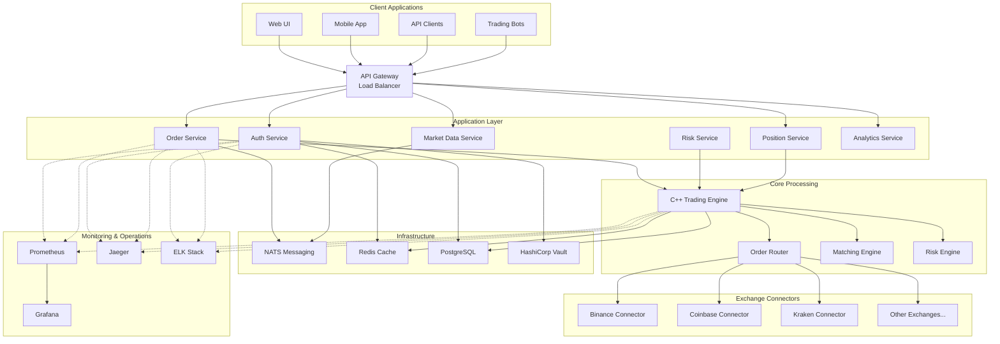

# System Overview

High-level architecture overview of the mExOms Multi-Exchange Order Management System.

## Architecture Diagram

## Component Overview

### Client Layer

#### Web UI
- React-based single-page application
- Real-time updates via WebSocket
- Responsive design for desktop and tablet
- Features: trading interface, portfolio management, analytics

#### Mobile App
- Native iOS and Android applications
- Push notifications for order updates
- Biometric authentication
- Optimized for on-the-go trading

#### API Clients
- RESTful API for traditional integration
- gRPC API for high-performance clients
- WebSocket API for real-time data
- Comprehensive SDKs (Python, Go, Java, Node.js)

#### Trading Bots
- Automated trading strategies
- Direct API access for low latency
- Strategy backtesting integration
- Risk management controls

### API Gateway

- **Load Balancing**: Distributes requests across service instances
- **Rate Limiting**: Prevents API abuse and ensures fair usage
- **Authentication**: JWT validation and API key verification
- **Request Routing**: Routes to appropriate backend services
- **SSL Termination**: Handles HTTPS encryption/decryption
- **Monitoring**: Tracks API usage and performance metrics

### Application Services

#### Auth Service
- User authentication (username/password, OAuth, SSO)
- Multi-factor authentication (TOTP, SMS, hardware keys)
- Session management with Redis
- API key generation and management
- Role-based access control (RBAC)
- Audit logging for security events

#### Order Service
- Order validation and submission
- Order lifecycle management
- Order history and search
- Batch order processing
- Conditional order support
- Integration with core engine

#### Market Data Service
- Real-time price streaming
- Order book aggregation
- Historical data API
- Market statistics calculation
- Data normalization across exchanges
- WebSocket distribution

#### Risk Service
- Pre-trade risk checks
- Position limit monitoring
- Exposure calculation
- VaR (Value at Risk) computation
- Real-time P&L tracking
- Risk alerts and notifications

#### Position Service
- Real-time position tracking
- Multi-exchange position aggregation
- P&L calculation
- Position history
- Portfolio analytics
- Tax reporting support

#### Analytics Service
- Performance metrics calculation
- Trading statistics
- Custom report generation
- Data export functionality
- Backtesting integration
- ML model serving

### Core Processing Engine

#### C++ Trading Engine
- **Performance**: Sub-100μs latency for order processing
- **Architecture**: Lock-free ring buffers for order flow
- **Throughput**: 100,000+ orders per second
- **Memory**: Pre-allocated memory pools to avoid allocation overhead
- **Threading**: CPU-pinned threads for consistent performance
- **Persistence**: Memory-mapped files for crash recovery

#### Order Router
- Smart order routing algorithms
- Best execution across exchanges
- Order splitting for large orders
- Arbitrage opportunity detection
- Latency-based routing decisions
- Fee optimization

#### Matching Engine
- Internal order crossing
- Dark pool functionality
- Price improvement mechanisms
- Order priority algorithms
- Partial fill handling
- Trade reporting

#### Risk Engine
- Real-time risk calculations
- Pre-trade validation
- Post-trade checks
- Margin calculations
- Exposure monitoring
- Circuit breaker implementation

### Exchange Connectors

#### Design Principles
- **Unified Interface**: Common API across all exchanges
- **Protocol Support**: REST, WebSocket, FIX where available
- **Error Handling**: Automatic retry with exponential backoff
- **Rate Limiting**: Respects exchange-specific limits
- **Data Normalization**: Consistent data format
- **Monitoring**: Health checks and latency tracking

#### Supported Exchanges
1. **Binance**: Spot and futures markets
2. **Coinbase**: Professional trading interface
3. **Kraken**: Spot and margin trading
4. **Bybit**: Derivatives trading
5. **OKX**: Comprehensive crypto trading
6. **Huobi**: Global market access
7. **BitMEX**: Bitcoin derivatives
8. **FTX**: (Historical/recovery support)
9. **Deribit**: Options and futures
10. **Gemini**: Regulated exchange

### Infrastructure Layer

#### NATS Messaging
- **Purpose**: Inter-service communication backbone
- **Features**: 
  - Pub/sub for market data distribution
  - Request/reply for service calls
  - JetStream for persistent messaging
  - Clustering for high availability
- **Performance**: 18M+ messages/second
- **Patterns**: Event sourcing, CQRS

#### Redis Cache
- **Use Cases**:
  - Session storage
  - Real-time market data cache
  - Rate limiting counters
  - Distributed locks
  - Pub/sub for real-time updates
- **Configuration**: 
  - Cluster mode for scalability
  - Persistence with AOF
  - Sentinel for high availability

#### PostgreSQL Database
- **Schema**: 
  - Orders and executions
  - User accounts and permissions
  - Exchange configurations
  - Audit trail
  - Historical market data
- **Optimizations**:
  - Partitioning for time-series data
  - Read replicas for analytics
  - Connection pooling with PgBouncer
  - Automated backups

#### HashiCorp Vault
- **Secrets Management**:
  - Exchange API keys
  - Database credentials
  - TLS certificates
  - Encryption keys
- **Features**:
  - Dynamic secret generation
  - Automatic key rotation
  - Audit logging
  - High availability mode

### Monitoring & Operations

#### Prometheus
- Metrics collection from all services
- Custom business metrics
- Alert rule evaluation
- Long-term storage with Thanos
- Federation for multi-region

#### Grafana
- Real-time dashboards
- Custom panels for trading metrics
- Alert visualization
- User-defined dashboards
- Mobile app support

#### Jaeger
- Distributed request tracing
- Latency analysis
- Dependency mapping
- Performance bottleneck identification
- Sampling strategies

#### ELK Stack
- **Elasticsearch**: Log indexing and search
- **Logstash**: Log collection and processing
- **Kibana**: Log visualization and analysis
- **Filebeat**: Log shipping from containers
- **Use Cases**: Error tracking, audit trails, debugging

## Data Flow

### Order Flow
1. Client submits order via API Gateway
2. Auth Service validates user permissions
3. Order Service performs initial validation
4. Order sent to C++ Engine via shared memory
5. Risk Engine performs pre-trade checks
6. Order Router determines best execution venue
7. Exchange Connector sends order to exchange
8. Execution updates flow back through system
9. Position Service updates positions
10. Notifications sent to client

### Market Data Flow
1. Exchange Connectors receive market data via WebSocket
2. Data normalized and published to NATS
3. Market Data Service aggregates across exchanges
4. Real-time data cached in Redis
5. WebSocket broadcast to subscribed clients
6. Historical data persisted to PostgreSQL

### Risk Management Flow
1. Continuous position monitoring by Risk Engine
2. Real-time P&L calculation
3. Risk metrics computed and cached
4. Alerts triggered on threshold breach
5. Automatic position reduction if configured
6. Risk reports generated for compliance

## Deployment Architecture

### Production Environment
- **Regions**: Multi-region deployment (US-East, EU-West, Asia-Pacific)
- **Availability Zones**: Distributed across 3 AZs per region
- **Load Balancing**: Global load balancer with geo-routing
- **CDN**: Static assets served via CloudFront/Cloudflare
- **Auto-scaling**: Horizontal pod autoscaling in Kubernetes

### Disaster Recovery
- **RTO**: 15 minutes (Recovery Time Objective)
- **RPO**: 1 minute (Recovery Point Objective)
- **Backup Strategy**: 
  - Continuous replication for databases
  - Hourly snapshots for persistent volumes
  - Cross-region backup storage
- **Failover**: Automated failover with health checks

### Security Architecture
- **Network Security**:
  - Private VPC with public/private subnets
  - Network ACLs and security groups
  - VPN access for administration
  - DDoS protection
- **Application Security**:
  - End-to-end encryption
  - Certificate pinning for mobile apps
  - Web Application Firewall (WAF)
  - Regular security audits

## Performance Characteristics

### Latency Targets
- Order processing: < 100μs (99th percentile)
- Risk checks: < 50μs (99th percentile)
- Exchange round-trip: < 10ms (depending on location)
- API response time: < 50ms (95th percentile)
- WebSocket latency: < 5ms (to client)

### Throughput Capacity
- Orders: 100,000+ per second
- Market data: 1,000,000+ updates per second
- API requests: 50,000+ per second
- WebSocket connections: 100,000+ concurrent
- Database writes: 25,000+ per second

### Scalability
- Horizontal scaling for stateless services
- Vertical scaling for C++ engine (up to 128 cores)
- Auto-scaling based on CPU, memory, and custom metrics
- Database read replicas for query distribution
- Cache clustering for increased capacity

---

*This document provides a high-level overview. For detailed component documentation, see the specific architecture documents.*